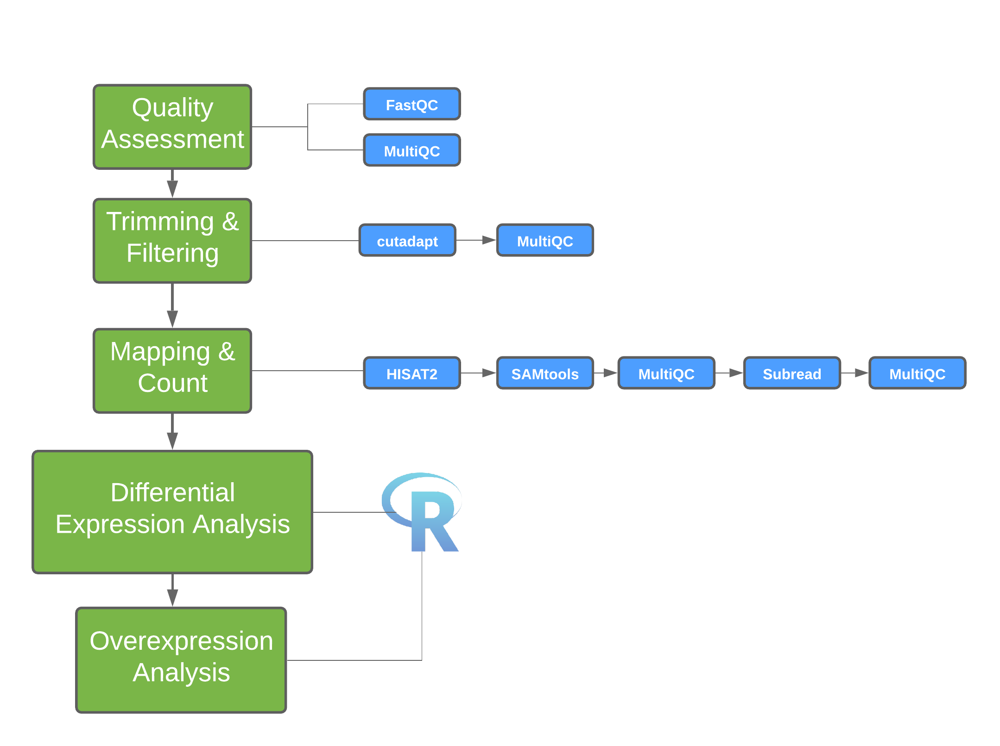

# Introduction

This workshop uses the dataset from yeast RNA-seq experiment, <a href="https://journals.plos.org/plosgenetics/article?id=10.1371/journal.pgen.1000299">Lee et al 2008 </a>

### Yeast Dataset
- Wild-type versus RNA degradation mutants
- Subset of data (chromosome 1)
- Six samples (3 WT / 3 MT)
- Single end sequencing
* * *

### Overview of Illumina Sequencing
Here is a <a href="https://www.youtube.com/watch?v=womKfikWlxM">video</a> to illumina sequencing.
* * *

---

# Workshop Overview

## RNA-seq Workflow
Before beginning an RNA-Seq experiment, you should understand and carefully consider each step of the RNA-Seq workflow: Experimental design, Extraction, Library preparation, Sequencing, and Data analysis.

### Experimental design
The design stage of your experiment is arguably the most critical step in ensuring the success of an RNA-Seq experiment. Researchers must make key decisions at the start of any NGS project, including the type of assay and the number of samples to analyze. The optimal approach will depend largely on the objectives of the experiment, hypotheses to be tested, and expected information to be gathered.

### Extraction
The first step in characterizing the transcriptome involves isolating and purifying cellular RNA. The quality and quantity
of the input material have a significant impact on data quality; therefore, care must be taken when isolating and preparing RNA for sequencing. Given the chemical instability of RNA, there are two major reasons for RNA degradation
during experiments:
(1) RNA contains ribose sugar and is not stable in alkaline conditions because of the reactive hydroxyl bonds. RNA is also more prone to heat degradation than DNA.
(2) Ribonucleases (RNases) are ubiquitous and very stable, so avoiding them is nearly impossible. It is essential to maintain an RNase-free environment by wearing sterile disposable gloves when handling reagents and RNA samples, employing RNase inhibitors, and using DEPC-treated
water instead of PCR-grade water. Additionally, proper storage of RNA is crucial to avoid RNA degradation.
In the short term, RNA may be stored in RNase-free water or TE buffer at -80°C for 1 year without degradation. For the long term, RNA samples may be stored as ethanol precipitates at -20°C. Avoid repeated freeze-thaw cycles of samples, which can lead to degradation. RNA of high integrity will maximize the likelihood of obtaining reliable and informative results.

### Library Preparation
This involves generating a collection of RNA fragments that are compatible for sequencing. The process involves enrichment of target (non-ribosomal) RNA, fragmentation, reverse transcription (i.e. cDNA synthesis), and addition of sequencing adapters and amplification. The enrichment method determines which types of transcripts (e.g. mRNA, lncRNA, miRNA) will be included in the library. In addition, the cDNA synthesis step can be performed in a such a way as to maintain the original strand orientation of the transcript, generating what is known as ‘strand-specific’ or ‘directional’ libraries.

### Sequencing
Parameters for sequencing—such as read length, configuration, and output—depend on the goals of your project and will influence your choice of instrument and sequencing chemistry. The main NGS technologies can be grouped into two categories: short-read (or ‘second generation’) sequencing, and long-read (or ‘third generation’) sequencing. Both have distinct benefits for RNA-Seq.

### Data Analysis

 

