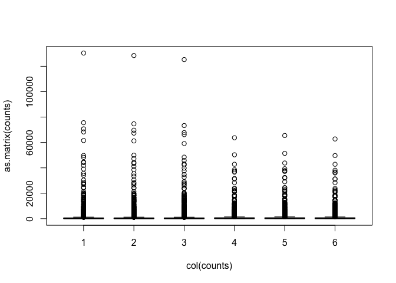
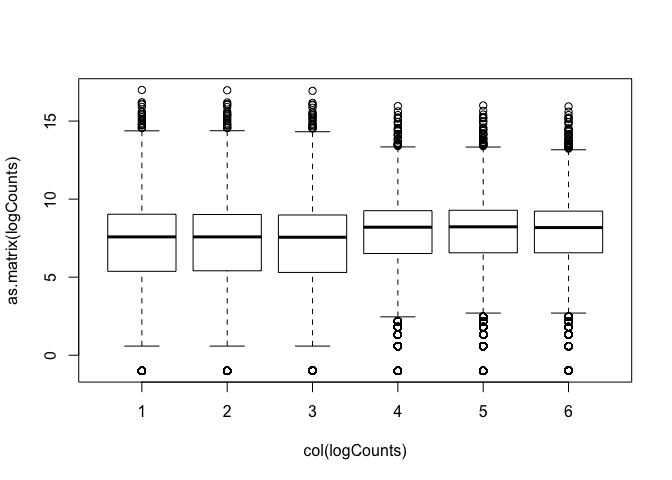

# Differential Expression Analysis using DESeq2
Ngoni Faya & Mik Black

### Recap

  - In the last section we worked through the process of quality
    assessment and alignment for RNA-seq data
  - This typically takes place on the command line, but can also be done
    from within R.
  - The end result was the generation of count data (counts of reads
    aligned to each gene, per sample) using the FeatureCounts command
    from Subread/Rsubread.
  - Now that we’ve got count data, we can begin our differental
    expression analysis.

### Data set reminder

  - Data obtained from yeast RNA-seq experiment,
    <a href="https://journals.plos.org/plosgenetics/article?id=10.1371/journal.pgen.1000299">Lee
    et al 2008 </a>
  - Wild-type versus RNA degradation mutants
  - Six samples (3 WT / 3 MT)
  - We are working with data from chromosome 1 to keep the files sizes
    relatively small.
    
    
Now let's make a new directory where we will store our RNA-seq data

```bash
$ cd ~/RNA-seq
$ mkdir DE

#copy the count data into this new DE directory
$ cp ../Counts/yeast_counts.txt ./
$ pwd (and copy the path)
```
* When using your own dataset, you would copy the count data into your DE directory, however in our case let's download the count data for this exercise from our Github page and store it in DE directory

* Hint: Use the wget or curl commands to download from this link: https://raw.githubusercontent.com/GenomicsAotearoa/RNA-seq-workshop/master/4.Differential_Expression/yeast_counts_all_chr.txt

## Import & pre-process

#### Import data from featureCounts 
(From the terminal - We got our count data using the command below) 
```bash
$ featureCounts -a ../Genome/Saccharomyces_cerevisiae.R64-1-1.99.gtf -o ./yeast_counts.txt -T 2 -t exon -g gene_id ../Mapping/*sorted.bam
```

Now let's open the R/4.1.0 notebook using NeSI Jupyter

```R
#set the working directory (you can paste the copied path here)
> setwd("/home/Your_User_Name/RNA_seq/DE")

# list the files in your current working directory (you must see 2 count data files in there - one from the previous data analysis and one we just downloaded)
> list.files()
```
### Count data

Note: I have now aligned the data for ALL CHROMOSOMES and generated
counts, so we are working with data from all 7127 genes.

*Let’s look at our dataset and perform some basic checks before we do a
differential expression analysis.*

```R
> library(dplyr)
> fcData = read.table('yeast_counts_all_chr.txt', sep='\t', header=TRUE)
> fcData %>% head()
```

    ##      Geneid Chr Start   End Strand Length ...STAR.SRR014335.Aligned.out.sam
    ## 1   YDL248W  IV  1802  2953      +   1152                                52
    ## 2 YDL247W-A  IV  3762  3836      +     75                                 0
    ## 3   YDL247W  IV  5985  7814      +   1830                                 2
    ## 4   YDL246C  IV  8683  9756      -   1074                                 0
    ## 5   YDL245C  IV 11657 13360      -   1704                                 0
    ## 6   YDL244W  IV 16204 17226      +   1023                                 6
    ##   ...STAR.SRR014336.Aligned.out.sam ...STAR.SRR014337.Aligned.out.sam
    ## 1                                46                                36
    ## 2                                 0                                 0
    ## 3                                 4                                 2
    ## 4                                 0                                 1
    ## 5                                 3                                 0
    ## 6                                 6                                 5
    ##   ...STAR.SRR014339.Aligned.out.sam ...STAR.SRR014340.Aligned.out.sam
    ## 1                                65                                70
    ## 2                                 0                                 1
    ## 3                                 6                                 8
    ## 4                                 1                                 2
    ## 5                                 5                                 7
    ## 6                                20                                30
    ##   ...STAR.SRR014341.Aligned.out.sam
    ## 1                                78
    ## 2                                 0
    ## 3                                 5
    ## 4                                 0
    ## 5                                 4
    ## 6                                19

Check dimensions:

```R
> dim(fcData)
```

    ## [1] 7127   12

```R
> names(fcData)
```

    ##  [1] "Geneid"                            "Chr"                              
    ##  [3] "Start"                             "End"                              
    ##  [5] "Strand"                            "Length"                           
    ##  [7] "...STAR.SRR014335.Aligned.out.sam" "...STAR.SRR014336.Aligned.out.sam"
    ##  [9] "...STAR.SRR014337.Aligned.out.sam" "...STAR.SRR014339.Aligned.out.sam"
    ## [11] "...STAR.SRR014340.Aligned.out.sam" "...STAR.SRR014341.Aligned.out.sam"

Rename data columns to reflect group membership

``` r
> names(fcData)[7:12] = c("WT1", "WT2", "WT3", "MT1", "MT2", "MT3")
 
> fcData %>% head()
```

    ##      Geneid Chr Start   End Strand Length WT1 WT2 WT3 MT1 MT2 MT3
    ## 1   YDL248W  IV  1802  2953      +   1152  52  46  36  65  70  78
    ## 2 YDL247W-A  IV  3762  3836      +     75   0   0   0   0   1   0
    ## 3   YDL247W  IV  5985  7814      +   1830   2   4   2   6   8   5
    ## 4   YDL246C  IV  8683  9756      -   1074   0   0   1   1   2   0
    ## 5   YDL245C  IV 11657 13360      -   1704   0   3   0   5   7   4
    ## 6   YDL244W  IV 16204 17226      +   1023   6   6   5  20  30  19

Extract count data

  - Remove annotation columns
  - Add row names

<!-- end list -->

``` r
> counts = fcData[, 7:12]
> rownames(counts) = fcData$Geneid
> counts %>% head()
```

    ##           WT1 WT2 WT3 MT1 MT2 MT3
    ## YDL248W    52  46  36  65  70  78
    ## YDL247W-A   0   0   0   0   1   0
    ## YDL247W     2   4   2   6   8   5
    ## YDL246C     0   0   1   1   2   0
    ## YDL245C     0   3   0   5   7   4
    ## YDL244W     6   6   5  20  30  19

#### Visualising the data

Data are highly skewed (suggests that logging might be useful):

``` r
> boxplot(as.matrix(counts) ~ col(counts))
```
<!-- -->

Some genes have zero counts:

``` r
> colSums(counts==0)
```

    ## WT1 WT2 WT3 MT1 MT2 MT3 
    ## 562 563 573 437 425 435

Log transformation (add 0.5 to avoid log(0) issues):

``` r
> logCounts = log2(as.matrix(counts)+ 0.5)
```

Now we can see the per-sample distributions more clearly:

``` r
> boxplot(as.matrix(logCounts) ~ col(logCounts))
```
<!-- -->

Density plots are also a good way to visualise the data:

``` r
> lineColour <- c("blue", "blue", "blue", "red", "red", "red")
> lineColour
```

    ## [1] "blue" "blue" "blue" "red"  "red"  "red"

``` r
> plot(density(logCounts[,1]), ylim=c(0,0.3), col=lineColour[1])
> for(i in 2:ncol(logCounts)) lines(density(logCounts[,i]), col=lineColour[i])
```

<!-- -->

The boxplots and density plots show clear differences between the sample
groups - are these biological, or experimental artifacts? (often we
don’t know).

#### Read counts per sample

Normalisation process (slightly different for each analysis method)
takes “library size” (number of reads generated for each sample) into
account.

``` r
> colSums(counts)
```

    ##     WT1     WT2     WT3     MT1     MT2     MT3 
    ## 4915975 4892227 4778158 4618409 4719413 4554283

Visualise via bar plot

``` r
> colSums(counts) %>% barplot(., ylab="Reads mapped per sample")
```
<!-- -->

<!--  -->

*Now we are ready for differential expression analysis*

## DESeq2 Analysis

  - The DESeq2 package uses the *Negative Binomial* distribution to
    model the count data from each sample.
  - A statistical test based on the Negative Binomial distribution (via
    a generalized linear model, GLM) can be used to assess differential
    expression for each gene.
  - Use of the Negative Binomial distribution attempts to accurately
    capture the variation that is observed for count data.

More information about DESeq2:
<a href="https://genomebiology.biomedcentral.com/articles/10.1186/s13059-014-0550-8">article
by Love et al, 2014</a>

```
> library(DESeq2)

# Specify "conditions" (groups: WT and MT)
> conds <- c("WT","WT","WT","MT","MT","MT")

# Convert to matrix
> countdata <- as.matrix(counts)
> head(countdata)
```
<!-- -->


```
# Create a coldata frame and instantiate the DESeqDataSet. See ?DESeqDataSetFromMatrix
> coldata <- data.frame(row.names=colnames(countdata), conds)
> dds <- DESeqDataSetFromMatrix(countData=countdata, colData=coldata, design=~conds)
> dds

class: DESeqDataSet 
dim: 7127 6 
metadata(1): version
assays(1): counts
rownames(7127): YDL248W YDL247W-A ... Q0285 Q0297
rowData names(0):
colnames(6): WT1 WT2 ... MT2 MT3
colData names(1): conds
```

#### Run the DESeq pipeline
```
> dds <- DESeq(dds)

estimating size factors

estimating dispersions

gene-wise dispersion estimates

mean-dispersion relationship

final dispersion estimates

fitting model and testing
```

#### Regularized log transformation for clustering/heatmaps, etc
```
> rld <- rlogTransformation(dds)
> head(assay(rld))
> hist(assay(rld))
```

* Colors for plots below
```
> library(RColorBrewer)
> mycols <- brewer.pal(8, "Dark2")[1:length(unique(conds))]
```

#### Sample distance heatmap
```
> sampleDists <- as.matrix(dist(t(assay(rld))))
> library(gplots)
> png("qc-heatmap-samples.png", w=1000, h=1000, pointsize=20)
> heatmap.2(as.matrix(sampleDists), key=F, trace="none",
          col=colorpanel(100, "red", "green"),
          ColSideColors=mycols[conds], RowSideColors=mycols[conds],
          margin=c(10, 10), main="Sample Distance Matrix")
> dev.off()
```


#### Principal components analysis
* Using the DESeq2 in-built method
```
> DESeq2::plotPCA(rld, intgroup="condition")
```
OR
* personal code

```
rld_pca <- function (rld, intgroup = "condition", ntop = 500, colors=NULL, legendpos="bottomleft", main="PCA Biplot", textcx=1, ...) {
  require(genefilter)
  require(calibrate)
  require(RColorBrewer)
  rv = rowVars(assay(rld))
  select = order(rv, decreasing = TRUE)[seq_len(min(ntop, length(rv)))]
  pca = prcomp(t(assay(rld)[select, ]))
  fac = factor(apply(as.data.frame(colData(rld)[, intgroup, drop = FALSE]), 1, paste, collapse = " : "))
  if (is.null(colors)) {
    if (nlevels(fac) >= 3) {
      colors = brewer.pal(nlevels(fac), "Paired")
    }   else {
      colors = c("black", "red")
    }
  }
  pc1var <- round(summary(pca)$importance[2,1]*100, digits=1)
  pc2var <- round(summary(pca)$importance[2,2]*100, digits=1)
  pc1lab <- paste0("PC1 (",as.character(pc1var),"%)")
  pc2lab <- paste0("PC1 (",as.character(pc2var),"%)")
  plot(PC2~PC1, data=as.data.frame(pca$x), bg=colors[fac], pch=21, xlab=pc1lab, ylab=pc2lab, main=main, ...)
  with(as.data.frame(pca$x), textxy(PC1, PC2, labs=rownames(as.data.frame(pca$x)), cex=textcx))
  legend(legendpos, legend=levels(fac), col=colors, pch=20)
  #     rldyplot(PC2 ~ PC1, groups = fac, data = as.data.frame(pca$rld),
  #            pch = 16, cerld = 2, aspect = "iso", col = colours, main = draw.key(key = list(rect = list(col = colours),
  #                                                                                         terldt = list(levels(fac)), rep = FALSE)))
}
png("qc-pca.png", 1000, 1000, pointsize=20)
rld_pca(rld, colors=mycols, intgroup="conds", xlim=c(-75, 35))
dev.off()
```

#### Getting differential expression results
```
> res <- results(dds)
> table(res$padj<0.05)
FALSE  TRUE 
 2019  4811 
# Order by adjusted p-value
> res <- res[order(res$padj), ]
> head(res)
log2 fold change (MLE): conds WT vs MT 
Wald test p-value: conds WT vs MT 
DataFrame with 6 rows and 6 columns
         baseMean log2FoldChange     lfcSE      stat    pvalue      padj
        <numeric>      <numeric> <numeric> <numeric> <numeric> <numeric>
YDL223C  10883.22        1.98548 0.0190608  104.1655         0         0
YDL222C   3028.11        4.07920 0.0501260   81.3790         0         0
YDL204W   5208.82        2.18545 0.0269624   81.0556         0         0
YDL195W   3695.54        1.97387 0.0314551   62.7519         0         0
YDL185W   5790.68        1.53969 0.0241512   63.7518         0         0
YDL145C   2681.02        1.35311 0.0349279   38.7401         0         0


# Merge with normalized count data
> resdata <- merge(as.data.frame(res), as.data.frame(counts(dds, normalized=TRUE)), by="row.names", sort=FALSE)
> names(resdata)[1] <- "Gene"
> head(resdata)
A data.frame: 6 × 13
Gene	baseMean	log2FoldChange	lfcSE	stat	pvalue	padj	WT1	WT2	WT3	MT1	MT2	MT3
<I<chr>>	<dbl>	<dbl>	<dbl>	<dbl>	<dbl>	<dbl>	<dbl>	<dbl>	<dbl>	<dbl>	<dbl>	<dbl>
1	YDL223C	10883.216	1.985482	0.01906084	104.16551	0	0	17474.229	17335.915	17323.452	4453.3839	4344.0962	4368.2196
2	YDL222C	3028.107	4.079201	0.05012597	81.37901	0	0	5801.384	5744.146	5607.619	310.2627	331.2583	373.9705
3	YDL204W	5208.823	2.185455	0.02696242	81.05559	0	0	8613.620	8504.693	8501.911	1887.2886	1865.1101	1880.3133
4	YDL195W	3695.539	1.973868	0.03145514	62.75186	0	0	5789.897	5916.608	5967.202	1524.7440	1468.4387	1506.3428
5	YDL185W	5790.680	1.539685	0.02415124	63.75181	0	0	8611.322	8625.417	8614.722	2934.6395	2944.4251	3013.5572
6	YDL145C	2681.016	1.353109	0.03492789	38.74008	0	0	3946.090	3833.263	3781.500	1528.1724	1522.1109	1474.9606

# Write results
> write.csv(resdata, file="diffexpr-results.csv")
```

#### Examine plot of p-values
```
> hist(res$pvalue, breaks=50, col="grey")
```


#### Summary of differential gene expression

``` r
> summary(res) 
```

    ## 
    ## out of 6830 with nonzero total read count
    ## adjusted p-value < 0.1
    ## LFC > 0 (up)       : 2520, 37%
    ## LFC < 0 (down)     : 2521, 37%
    ## outliers [1]       : 0, 0%
    ## low counts [2]     : 0, 0%
    ## (mean count < 0)
    ## [1] see 'cooksCutoff' argument of ?results
    ## [2] see 'independentFiltering' argument of ?results
    

- Remove rows with NAs
```
> res = na.omit(res)
```

 - Get the rows of "res" with significant adjusted p-values
```
> resPadj<-res[res$padj <= 0.05 , ]
```

- Get dimensions
```
> dim(resPadj)
[1] 4811    6
```

- Number of adjusted p-values less than 0.05

``` r
> sum(res$padj <= 0.05)
[1] 4811
```
MA plot to summmarise the DESeq output
```
> plotMA(dds,ylim=c(-2,2),main='DESeq2')
```


#### Volcano plot with "significant" genes labeled
```
> volcanoplot <- function (res, lfcthresh=2, sigthresh=0.05, main="Volcano Plot", legendpos="bottomright", labelsig=TRUE, textcx=1, ...) {
  with(res, plot(log2FoldChange, -log10(pvalue), pch=20, main=main, ...))
  with(subset(res, padj<sigthresh ), points(log2FoldChange, -log10(pvalue), pch=20, col="red", ...))
  with(subset(res, abs(log2FoldChange)>lfcthresh), points(log2FoldChange, -log10(pvalue), pch=20, col="orange", ...))
  with(subset(res, padj<sigthresh & abs(log2FoldChange)>lfcthresh), points(log2FoldChange, -log10(pvalue), pch=20, col="green", ...))
  if (labelsig) {
    require(calibrate)
    with(subset(res, padj<sigthresh & abs(log2FoldChange)>lfcthresh), textxy(log2FoldChange, -log10(pvalue), labs=Gene, cex=textcx, ...))
  }
  legend(legendpos, xjust=1, yjust=1, legend=c(paste("FDR<",sigthresh,sep=""), paste("|LogFC|>",lfcthresh,sep=""), "both"), pch=20, col=c("red","orange","green"))
}
> png("diffexpr-volcanoplot.png", 1200, 1000, pointsize=20)
> volcanoplot(resdata, lfcthresh=1, sigthresh=0.05, textcx=.8, xlim=c(-2.3, 2))
> dev.off()
```
---  
  
#### Saving the toptable for the next section
```
> tt = resPadj
> save(list='tt', file='topTable.RData')
```

- - - 

[Next Lesson : Over-representation Analysis](../5.Overrepresentation_Analysis/rnaseq-pathway.md)

