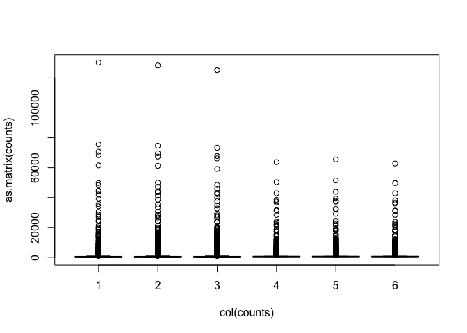
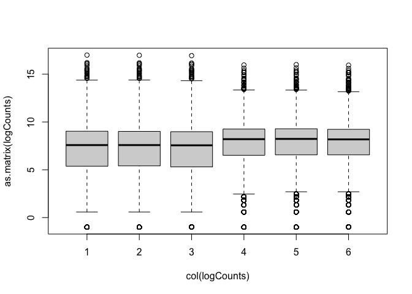

RNA-seq data analysis in R
================
Mik Black & Ngoni Faya
25 June 2020

## RNA-seq: overview

### Recap

  - In the last section we worked through the process of quality
    assessment and alignment for RNA-seq data
  - This typically takes place on the command line, but can also be done
    from within R.
  - The end result was the generation of count data (counts of reads
    aligned to each gene, per sample) using the FeatureCounts command
    from Subread/Rsubread.
  - Now that we’ve got count data in R, we can begin our differental
    expression analysis.

### Data set reminder

  - Data obtained from yeast RNA-seq experiment,
    <a href="https://journals.plos.org/plosgenetics/article?id=10.1371/journal.pgen.1000299">Lee
    et al 2008 </a>
  - Wild-type versus RNA degradation mutants
  - Six samples (3 WT / 3 MT)
  - We are working with data from chromosome 1 to keep the files sizes
    relatively small.

## Getting organised

### Create an RStudio project

One of the first benefits we will take advantage of in RStudio is
something called an RStudio Project. An RStudio project allows you to
more easily:

  - Save data, files, variables, packages, etc. related to a specific
    analysis project
  - Restart work where you left off
  - Collaborate, especially if you are using version control such as
    git.

To create a project, - Open RStudio and go to the File menu, and click
New Project. - In the window that opens select Existing Project, and
browse to the RNA-seq folder we have created on our Desktop. - Finally,
click Create Project

(save source from untitled to yeast\_data.R and continue saving
reguralry as we work)

### Count data

  - Note: I have now aligned the data for ALL CHROMOSOMES and generated
    counts, so we are working with data from all 7127 genes.

*Let’s look at our dataset and manipulate it is as we prepare for
differential expression.*

``` r
library(dplyr)
fcData = read.table('yeast_counts_all_chr.txt', sep='\t', header=TRUE)
fcData %>% head()
```

    ##      Geneid Chr Start   End Strand Length ...STAR.SRR014335.Aligned.out.sam
    ## 1   YDL248W  IV  1802  2953      +   1152                                52
    ## 2 YDL247W-A  IV  3762  3836      +     75                                 0
    ## 3   YDL247W  IV  5985  7814      +   1830                                 2
    ## 4   YDL246C  IV  8683  9756      -   1074                                 0
    ## 5   YDL245C  IV 11657 13360      -   1704                                 0
    ## 6   YDL244W  IV 16204 17226      +   1023                                 6
    ##   ...STAR.SRR014336.Aligned.out.sam ...STAR.SRR014337.Aligned.out.sam
    ## 1                                46                                36
    ## 2                                 0                                 0
    ## 3                                 4                                 2
    ## 4                                 0                                 1
    ## 5                                 3                                 0
    ## 6                                 6                                 5
    ##   ...STAR.SRR014339.Aligned.out.sam ...STAR.SRR014340.Aligned.out.sam
    ## 1                                65                                70
    ## 2                                 0                                 1
    ## 3                                 6                                 8
    ## 4                                 1                                 2
    ## 5                                 5                                 7
    ## 6                                20                                30
    ##   ...STAR.SRR014341.Aligned.out.sam
    ## 1                                78
    ## 2                                 0
    ## 3                                 5
    ## 4                                 0
    ## 5                                 4
    ## 6                                19

Further checking our dataset

``` r
dim(fcData)
```

    ## [1] 7127   12

``` r
names(fcData)
```

    ##  [1] "Geneid"                            "Chr"                              
    ##  [3] "Start"                             "End"                              
    ##  [5] "Strand"                            "Length"                           
    ##  [7] "...STAR.SRR014335.Aligned.out.sam" "...STAR.SRR014336.Aligned.out.sam"
    ##  [9] "...STAR.SRR014337.Aligned.out.sam" "...STAR.SRR014339.Aligned.out.sam"
    ## [11] "...STAR.SRR014340.Aligned.out.sam" "...STAR.SRR014341.Aligned.out.sam"

Rename data columns

``` r
names(fcData)[7:12] = c("WT1", "WT2", "WT3", "MT1", "MT2", "MT3")
 
fcData %>% head()
```

    ##      Geneid Chr Start   End Strand Length WT1 WT2 WT3 MT1 MT2 MT3
    ## 1   YDL248W  IV  1802  2953      +   1152  52  46  36  65  70  78
    ## 2 YDL247W-A  IV  3762  3836      +     75   0   0   0   0   1   0
    ## 3   YDL247W  IV  5985  7814      +   1830   2   4   2   6   8   5
    ## 4   YDL246C  IV  8683  9756      -   1074   0   0   1   1   2   0
    ## 5   YDL245C  IV 11657 13360      -   1704   0   3   0   5   7   4
    ## 6   YDL244W  IV 16204 17226      +   1023   6   6   5  20  30  19

Extract count data

  - Remove annotation columns
  - Add row names

<!-- end list -->

``` r
counts = fcData[, 7:12]
rownames(counts) = fcData$Geneid
counts %>% head()
```

    ##           WT1 WT2 WT3 MT1 MT2 MT3
    ## YDL248W    52  46  36  65  70  78
    ## YDL247W-A   0   0   0   0   1   0
    ## YDL247W     2   4   2   6   8   5
    ## YDL246C     0   0   1   1   2   0
    ## YDL245C     0   3   0   5   7   4
    ## YDL244W     6   6   5  20  30  19

#### Visualising the data

``` r
boxplot(as.matrix(counts) ~ col(counts))
```

<!-- -->

``` r
colSums(counts==0)
```

    ## WT1 WT2 WT3 MT1 MT2 MT3 
    ## 562 563 573 437 425 435

``` r
logCounts = log2(as.matrix(counts)+ 0.5)
```

``` r
boxplot(as.matrix(logCounts) ~ col(logCounts))
```

<!-- -->

``` r
lineColour <- c("blue", "blue", "blue", "red", "red", "red")
lineColour
```

    ## [1] "blue" "blue" "blue" "red"  "red"  "red"

``` r
plot(density(logCounts[,1]), ylim=c(0,0.3), col=lineColour[1])
for(i in 2:ncol(logCounts)) lines(density(logCounts[,i]), col=lineColour[i])
```

<!-- -->

#### Read counts per sample

  - Normalisation process (slightly different for each analysis method)
    takes “library size” (number of reads generated for each sample)
    into account.

<!-- end list -->

``` r
colSums(counts)
```

    ##     WT1     WT2     WT3     MT1     MT2     MT3 
    ## 4915975 4892227 4778158 4618409 4719413 4554283

Visualise via bar plot

``` r
colSums(counts) %>% barplot(., ylab="Reads mapped per sample")
```

<!-- -->

<!--  -->

*Now we are ready for differential expression analysis*

## Detecting differential expression:

We are going to identify genes that are differential expressed using 3
different packages (time allowing) and compare the results.

But first, lets take a brief aside, and talk about the process of
detecting genes that have undergone a statistically significance change
in expression between the two groups.

**INSERT LINK TO “LECTURE” SLIDES**

-----

### Limma

<!-- NEED TO EXPLAIN "TREND=TRUE" -->

  - Limma can be used for analysis (log-scale normality-based assumption
    rather than Negative Binomial for count data)
  - Use data transformation and log to satisfy normality assumptions
    (CPM = Counts per Million).

<!-- end list -->

``` r
library(limma)
library(edgeR)
# Specify "conditions" (groups: WT and MT)
conds <- c("WT","WT","WT","MT","MT","MT")

design <- model.matrix(~conds)
design
```

    ##   (Intercept) condsWT
    ## 1           1       1
    ## 2           1       1
    ## 3           1       1
    ## 4           1       0
    ## 5           1       0
    ## 6           1       0
    ## attr(,"assign")
    ## [1] 0 1
    ## attr(,"contrasts")
    ## attr(,"contrasts")$conds
    ## [1] "contr.treatment"

``` r
dge <- DGEList(counts=counts)
dge <- calcNormFactors(dge)
logCPM <- cpm(dge, log=TRUE, prior.count=3)

options(width=100)
head(logCPM, 3)
```

    ##                  WT1        WT2        WT3        MT1        MT2        MT3
    ## YDL248W    3.7199528  3.5561232  3.2538405  3.6446399  3.7156488  3.9155366
    ## YDL247W-A -0.6765789 -0.6765789 -0.6765789 -0.6765789 -0.3140297 -0.6765789
    ## YDL247W    0.1484688  0.6727144  0.1645731  0.7843936  1.0395626  0.6349276

``` r
library(goseq)
geneLengths = getlength(rownames(counts), "sacCer2","ensGene")
rpkmData <- rpkm(dge, geneLengths)
rpkmData %>% round(., 2) %>% head()
```

    ##             WT1  WT2  WT3   MT1   MT2   MT3
    ## YDL248W   10.89 9.66 7.73 10.30 10.85 12.55
    ## YDL247W-A  0.00 0.00 0.00  0.00  2.35  0.00
    ## YDL247W    0.26 0.53 0.27  0.60  0.78  0.51
    ## YDL246C    0.00 0.00 0.23  0.17  0.33  0.00
    ## YDL245C    0.00 0.43 0.00  0.54  0.73  0.44
    ## YDL244W    1.41 1.42 1.21  3.57  5.24  3.44

``` r
range(rpkmData, na.rm=TRUE)
```

    ## [1]     0.00 69786.58

``` r
par(mfrow=c(2,3))
for(i in 1:ncol(rpkmData)){
  plot(logCPM[,i], log2(rpkmData[,i]), pch='.', 
       xlab="logCPM", ylab="RPKM", main=colnames(logCPM)[i])
}
```

<!-- -->

### Back to the analysis… (using logCPM)

What if we just did a t-test?

``` r
library(beeswarm)
t.test(logCPM[6,] ~ conds)
```

    ## 
    ##  Welch Two Sample t-test
    ## 
    ## data:  logCPM[6, ] by conds
    ## t = 7.0124, df = 2.3726, p-value = 0.01228
    ## alternative hypothesis: true difference in means is not equal to 0
    ## 95 percent confidence interval:
    ##  0.5840587 1.9006761
    ## sample estimates:
    ## mean in group MT mean in group WT 
    ##         2.244310         1.001943

``` r
beeswarm(logCPM[6,] ~ conds, pch=16, ylab="Expression (logCPM)", xlab="Group",
         main=paste0(rownames(logCPM)[6], ": MT vs WT"))
```

<!-- -->

Before we get to statistical testing, we first need to do a little bit
more normalisation.

**Limma: voom**

The “voom” function estimates relationship between the mean and the
variance of the logCPM data, normalises the data, and creates “precision
weights” for each observation that are incorporated into the limma
analysis.

``` r
v <- voom(dge, design, plot=TRUE)
```

<!-- -->

<!--  -->

*Limma: voom* (impact on samples)

``` r
par(mfrow=c(2,3))
for(i in 1:ncol(logCPM)){
  plot(logCPM[,i], v$E[,i], xlab="LogCPM",
       ylab="Voom",main=colnames(logCPM)[i])
  abline(0,1)
}
```

<!-- -->

<!--  -->

``` r
boxplot(v$E ~ col(v$E))
```

<!-- -->

``` r
lineColour <- ifelse(conds=="MT", "red", "blue")
lineColour
```

    ## [1] "blue" "blue" "blue" "red"  "red"  "red"

``` r
plot(density(v$E[,1]), ylim=c(0,0.3), col=lineColour[1])
for(i in 2:ncol(logCPM)) lines(density(v$E[,i]), col=lineColour[i])
```

<!-- -->

``` r
q <- voom(dge, design, plot=TRUE, normalize="quantile")
```

<!-- -->

``` r
par(mfrow=c(2,3))
for(i in 1:ncol(logCPM)){
  plot(logCPM[,i], q$E[,i], xlab="LogCPM",
       ylab="Voom (+quantile norm)",main=colnames(logCPM)[i])
  abline(0,1)
}
```

<!-- -->

``` r
boxplot(q$E ~ col(q$E))
```

<!-- -->

``` r
lineColour <- ifelse(conds=="MT", "red", "blue")
lineColour
```

    ## [1] "blue" "blue" "blue" "red"  "red"  "red"

``` r
plot(density(q$E[,1]), ylim=c(0,0.3), col=lineColour[1])
for(i in 2:ncol(logCPM)) lines(density(q$E[,i]), col=lineColour[i])
```

<!-- -->

**Statistical testing: fitting a linear model**

``` r
fit <- lmFit(v, design)
fit <- eBayes(fit)
tt <- topTable(fit, coef=ncol(design), n=nrow(counts))

head(tt)
```

    ##            logFC  AveExpr        t      P.Value    adj.P.Val        B
    ## YAL038W 2.313985 10.80214 319.5950 3.725452e-13 8.850433e-10 21.08951
    ## YOR161C 2.568389 10.80811 321.9628 3.574510e-13 8.850433e-10 21.08187
    ## YML128C 1.640664 11.40819 286.6167 6.857932e-13 9.775297e-10 20.84520
    ## YMR105C 2.772539  9.65092 331.8249 3.018547e-13 8.850433e-10 20.16815
    ## YHL021C 2.034496 10.17510 269.4034 9.702963e-13 1.152550e-09 20.07857
    ## YDR516C 2.085424 10.05426 260.8061 1.163655e-12 1.184767e-09 19.87217

``` r
fitq <- lmFit(q, design)
fitq <- eBayes(fitq)
ttq <- topTable(fitq, coef=ncol(design), n=nrow(counts))

head(ttq)
```

    ##              logFC  AveExpr          t      P.Value    adj.P.Val        B
    ## YDR077W  0.8639934 12.95928  2179.3528 6.195761e-16 2.207860e-12 28.00141
    ## YCL040W  2.1258023 12.43036  2353.4164 4.243029e-16 2.207860e-12 27.33008
    ## YFL014W -0.8000685 13.09322 -1790.5198 1.631559e-15 3.876040e-12 27.03513
    ## YDL022W  0.2666330 13.52460  1595.4222 2.880451e-15 5.132244e-12 25.82946
    ## YGL008C -0.6937168 12.58984 -1027.0814 2.522564e-14 3.595662e-11 24.27597
    ## YER062C -0.4654310 12.76000  -853.3046 6.287307e-14 7.468273e-11 23.17832

``` r
sum(tt$adj.P.Val < 0.01)
```

    ## [1] 4566

``` r
sum(ttq$adj.P.Val < 0.01)
```

    ## [1] 4191

``` r
length(intersect(rownames(tt)[tt$adj.P.Val < 0.01], rownames(ttq)[ttq$adj.P.Val < 0.01]))
```

    ## [1] 3612

*limma: adjusted p-values*

``` r
sum(tt$adj.P.Val <= 0.05)
```

    ## [1] 5140

``` r
sum(p.adjust(tt$P.Value, method="fdr") <= 0.05)
```

    ## [1] 5140

``` r
## Get the rows of top table with significant adjusted p-values
limmaPadj <- tt[tt$adj.P.Val <= 0.05, ]
```

``` r
volcanoplot(fit, coef=2)
abline(h=-log10(0.05))
```

<!-- -->

``` r
sigGenes = which(tt$adj.P.Val <= 0.05)
length(sigGenes)
```

    ## [1] 5140

``` r
volcanoplot(fit, coef=2)
points(tt$logFC[sigGenes], -log10(tt$P.Value[sigGenes]), col='red', pch=16, cex=0.5)
```

<!-- -->

``` r
sigGenes = which(tt$adj.P.Val <= 0.05 & (abs(tt$logFC) > log2(2)))
length(sigGenes)
```

    ## [1] 1891

``` r
volcanoplot(fit, coef=2)
points(tt$logFC[sigGenes], -log10(tt$P.Value[sigGenes]), col='red', pch=16, cex=0.5)
```

<!-- -->

-----

### DESeq2

  - The DESeq2 package uses the *Negative Binomial* distribution to
    model the count data from each sample.
  - A statistical test based on the Negative Binomial distribution (via
    a generalized linear model, GLM) can be used to assess differential
    expression for each gene.
  - Use of the Negative Binomial distribution attempts to accurately
    capture the variation that is observed for count data.

More information about DESeq2:
<a href="https://genomebiology.biomedcentral.com/articles/10.1186/s13059-014-0550-8">article
by Love et al, 2014</a>

``` r
library(DESeq2)

# Create object of class CountDataSet derived from eSet class
dds <- DESeqDataSetFromMatrix(countData = as.matrix(counts), 
                              colData = data.frame(conds=factor(conds)), 
                              design = formula(~conds))

# CountDataSet has similar accessor methods as eSet class.
knitr::kable(counts(dds)[1:4, ]) 
```

|           | WT1 | WT2 | WT3 | MT1 | MT2 | MT3 |
| --------- | --: | --: | --: | --: | --: | --: |
| YDL248W   |  52 |  46 |  36 |  65 |  70 |  78 |
| YDL247W-A |   0 |   0 |   0 |   0 |   1 |   0 |
| YDL247W   |   2 |   4 |   2 |   6 |   8 |   5 |
| YDL246C   |   0 |   0 |   1 |   1 |   2 |   0 |

Fit DESeq model to identify DE transcripts

``` r
dds <- DESeq(dds)

#Taking a look at the results table
res <- DESeq2::results(dds)

knitr::kable(res[1:6,])
```

|           |   baseMean | log2FoldChange |     lfcSE |        stat |    pvalue |      padj |
| --------- | ---------: | -------------: | --------: | ----------: | --------: | --------: |
| YDL248W   | 56.2230316 |    \-0.2339470 | 0.2278417 | \-1.0267961 | 0.3045165 | 0.3663639 |
| YDL247W-A |  0.1397714 |    \-0.5255769 | 4.0804729 | \-0.1288030 | 0.8975136 | 0.9173926 |
| YDL247W   |  4.2428211 |    \-0.8100552 | 0.8332543 | \-0.9721584 | 0.3309718 | 0.3948536 |
| YDL246C   |  0.6182409 |    \-1.0326364 | 2.1560899 | \-0.4789394 | 0.6319817 | 0.6915148 |
| YDL245C   |  2.8486580 |    \-1.9781751 | 1.1758845 | \-1.6822869 | 0.0925132 | 0.1230028 |
| YDL244W   | 13.0883354 |    \-1.5823354 | 0.5128788 | \-3.0852037 | 0.0020341 | 0.0032860 |

Summary of differential gene expression

``` r
#summary of results
summary(res) 
```

    ## 
    ## out of 6830 with nonzero total read count
    ## adjusted p-value < 0.1
    ## LFC > 0 (up)       : 2520, 37%
    ## LFC < 0 (down)     : 2521, 37%
    ## outliers [1]       : 0, 0%
    ## low counts [2]     : 0, 0%
    ## (mean count < 0)
    ## [1] see 'cooksCutoff' argument of ?results
    ## [2] see 'independentFiltering' argument of ?results

Note: p-value adjustment

  - The “padj” column of the DESeq2 results (`res`) contains adjusted
    p-values (FDR).
  - Can use the `p.adjust` function to manually adjust the DESeq2
    p-values if needed (e.g., to use Holm correction)

<!-- end list -->

``` r
# Remove rows with NAs
res = na.omit(res)

# Get the rows of "res" with significant adjusted p-values
resPadj<-res[res$padj <= 0.05 , ]

# Get dimensions
dim(resPadj)
```

    ## [1] 4811    6

``` r
# Number of adjusted p-values less than 0.05
sum(res$padj <= 0.05)
```

    ## [1] 4811

``` r
# Check that this is the same using p.adjust with FDR correction
sum(p.adjust(res$pvalue, method="fdr") <= 0.05)
```

    ## [1] 4811

``` r
# Number of Holm adjusted p-values less than 0.05
sum(p.adjust(res$pvalue, method="holm") <= 0.01)
```

    ## [1] 3429

Sort summary list by p-value and save the table as a CSV file that can
be read in Excel (or any other spreadhseet program).

``` r
res <- res[order(res$padj),]

write.csv(as.data.frame(res),file='deseq2.csv')
```

Volcano plot

``` r
# reset par
# par(mfrow=c(1,1))

# Make a basic volcano plot
with(res, plot(log2FoldChange, -log10(pvalue), pch=20, main="Volcano plot", xlim=c(-3,3)))

# Add colored points: blue if padj<0.01, red if log2FC>1 and padj<0.05)
with(subset(res, padj<.01 ), points(log2FoldChange, -log10(pvalue), pch=20, col="blue"))
with(subset(res, padj<.01 & abs(log2FoldChange)>2), points(log2FoldChange, -log10(pvalue), pch=20, col="red"))
```

<!-- -->

-----

<!--  -->

### edgeR

  - The edgeR package also uses the negative binomial distribution to
    model the RNA-seq count data.
  - Takes an empirical Bayes approach to the statistical analysis, in a
    similar way to how the `limma` package handles microarray data.

*Identify DEGs with edgeR’s Exact Method*

``` r
library(edgeR)

# Construct DGEList object
y <- DGEList(counts=counts, group=conds)

# Calculate library size (counts per sample)
y <- calcNormFactors(y)

# Estimate common dispersion (overall variability)
y <- estimateCommonDisp(y)

# Estimate tagwise dispersion (per gene variability)
y <- estimateTagwiseDisp(y)
```

\*edgeR analysis and output

``` r
# Compute exact test for the negative binomial distribution.
et <- exactTest(y) 

knitr::kable(topTags(et, n=4)$table)
```

|         |      logFC |    logCPM | PValue | FDR |
| ------- | ---------: | --------: | -----: | --: |
| YCR077C |  13.098599 |  6.629306 |      0 |   0 |
| snR71   | \-9.870811 |  8.294459 |      0 |   0 |
| snR59   | \-8.752555 | 10.105453 |      0 |   0 |
| snR53   | \-8.503101 |  7.687908 |      0 |   0 |

*adjusted p-values*

``` r
edge <- as.data.frame(topTags(et, n=nrow(counts))) 
sum(edge$FDR <= 0.05)
```

    ## [1] 5242

``` r
sum(p.adjust(edge$PValue, method="fdr") <= 0.05)
```

    ## [1] 5242

``` r
## Get the rows of "edge" with significant adjusted p-values
edgePadj <- edge[edge$FDR <= 0.05, ]
```

### DESeq2 vs edgeR

  - Generate Venn diagram to compare DESeq2 and edgeR results.

<!-- end list -->

``` r
library(systemPipeR)
setlist <- list(edgeRexact=rownames(edgePadj), DESeq2=rownames(resPadj))
vennset <- overLapper(setlist=setlist[1:2], type="vennsets")
vennPlot(vennset, mymain="DEG Comparison")
```

<!-- -->

<!--  -->

-----

### Limma vs edgeR vs DESeq2

``` r
setlist <- list(edgeRexact=rownames(edgePadj), 
                DESeq2=rownames(resPadj),
                LimmaVoom=rownames(limmaPadj))

vennset <- overLapper(setlist=setlist[1:3], type="vennsets")

vennPlot(vennset, mymain="DEG Comparison")
```

<!-- -->

### Save topTable results for next session…

``` r
save(list='tt', file='topTable.RData')
```

<!--  -->
