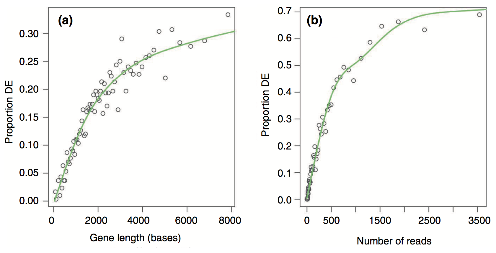
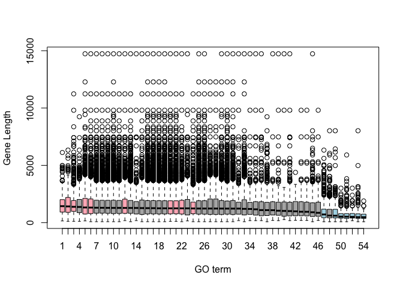
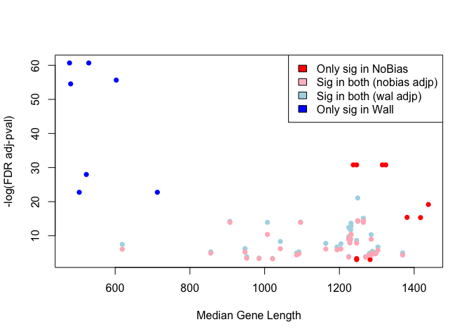

RNA-seq data analysis in R
================
Mik Black & Ngoni Faya
25 June 2020

### Overrepresentation analysis (Gene Ontology)

Over Representation Analysis
(<a href="https://academic.oup.com/bioinformatics/article/20/18/3710/202612">Boyle
et al. 2004</a>) is a widely used approach to determine whether known
biological functions or processes are over-represented (= enriched) in
an experimentally-derived gene list, e.g. a list of differentially
expressed genes (DEGs).

  - Can perform overrepresentation analysis online (e.g., GATHER,
    GeneSetDB, PantherDB), and also in R.
  - The basic principles are to:
      - identify a collection of differentially expressed genes
      - test to see if genes that are members of specific gene sets
        (e.g.Reactome pathways, Gene Ontologies categories) are
        differentially expressed more often than would be expected by
        chance.

*Some caveats for RNA-seq data*

  - The gene-set analysis methods are applicable to transcriptomic data
    from both microarrays and RNA-seq.
  - One caveat, however, is that the results need to take *gene length*
    into account.
  - RNA-seq tends to produce higher expression levels (i.e., greater
    counts) for longer genes: a longer transcript implies more aligned
    fragments, and thus higher counts. This also gives these genes a
    great chance of being statistically differentially expressed.
  - Some gene sets (pathways, GO terms) tend to involve families of long
    genes: if long genes have a great chance of being detected as
    differentially expressed, then *gene sets* consisting of long genes
    will have a great chance of appeared to be enriched in the analysis.

### GOseq

  - The GOseq methodology
    (<a href="https://genomebiology.biomedcentral.com/articles/10.1186/gb-2010-11-2-r14">Young
    et al., 2010</a>) overcomes this issue by allowing the
    over-representation analysis to be adjusted for gene length.
  - modification to hypergeometric sampling probability
  - exact method (resampling) and an approximation-based method
  - More recent publications have also applied this gene-length
    correction to GSEA-based methods.
  - Still not widely understood to be an issue when performing RNA-seq
    pathway analysis, but REALLY important to take into account.

#### Results from the Young et al (2010) publication:

*Proportion DE by gene length and reads*

<center>



</center>

*Gene set ranks by standard analysis*

<center>


</center>

*Gene set ranks by GOseq*

<center>


</center>

### GOseq analysis

Need to figure out if our organism is supported… (code is “sacCer”)

``` r
library(magrittr)
library(goseq)
supportedOrganisms() %>% head()
```

    ##     Genome         Id  Id Description Lengths in geneLeneDataBase
    ## 12 anoCar1    ensGene Ensembl gene ID                        TRUE
    ## 13 anoGam1    ensGene Ensembl gene ID                        TRUE
    ## 14 apiMel2    ensGene Ensembl gene ID                        TRUE
    ## 56 bosTau2 geneSymbol     Gene Symbol                        TRUE
    ## 15 bosTau3    ensGene Ensembl gene ID                        TRUE
    ## 57 bosTau3 geneSymbol     Gene Symbol                        TRUE
    ##    GO Annotation Available
    ## 12                   FALSE
    ## 13                    TRUE
    ## 14                   FALSE
    ## 56                    TRUE
    ## 15                    TRUE
    ## 57                    TRUE

Easier to find if we use `View()`

``` r
supportedOrganisms() %>% View()
```

*Define differentially expressed genes*

  - Create a vector of 0’s and 1’s to denote whether or not genes are
    differentially expressed (limma analysis: topTable).
  - Add gene names to the vector so that GOSeq knows which gene each
    data point relates to.

Load our topTable results from last session:

``` r
load('topTable.RData')
```

``` r
genes <- ifelse(tt$adj.P.Val < 0.05, 1, 0)
names(genes) <- rownames(tt)
head(genes)
```

    ## YAL038W YOR161C YML128C YMR105C YHL021C YDR516C 
    ##       1       1       1       1       1       1

``` r
table(genes)
```

    ## genes
    ##    0    1 
    ## 1987 5140

#### Calculate gene weights

  - Put genes into length-based “bins”, and plot length vs proportion
    differentially expressed
  - Likely restricts to only those genes with GO annotation

<!-- end list -->

``` r
pwf=nullp(genes,"sacCer1","ensGene")
```

<!-- --> 

#### Inspect output

Report length (bias) and weight data per gene.

``` r
head(pwf)
```

    ##         DEgenes bias.data       pwf
    ## YAL038W       1      1504 0.8205505
    ## YOR161C       1      1621 0.8205505
    ## YML128C       1      1543 0.8205505
    ## YMR105C       1      1711 0.8205505
    ## YHL021C       1      1399 0.8205505
    ## YDR516C       1      1504 0.8205505

#### Gene lengths and weights

``` r
par(mfrow=c(1,2))
hist(pwf$bias.data,30)
hist(pwf$pwf,30)
```

<!-- -->

<!--  -->

#### Gene length vs average expression

Is there an association between gene length and expression level?

``` r
library(ggplot2)
data.frame(logGeneLength = log2(pwf$bias.data), 
           avgExpr = tt$AveExpr) %>% 
  ggplot(., aes(x=logGeneLength, y=avgExpr)) + 
  geom_point(size=0.2) + 
  geom_smooth(method='lm')
```

<!-- -->

How about gene length and statistical evidence supporting differential
expression?

(Kinda hard to see, but it is apparently there…)

``` r
data.frame(logGeneLength = log2(pwf$bias.data), 
           negLogAdjP = -log10(tt$adj.P.Val)) %>% 
  ggplot(., aes(x=logGeneLength, negLogAdjP)) + 
  geom_point(size=0.2) + 
  geom_smooth(method='lm')
```

<!-- -->

<!--  -->

#### Length correction in GOSeq

  - Uses “Wallenius approximation” to perform correction.
  - Essentially it is performing a weighted Fisher’s Exact Test, but
    each gene in the 2x2 data does not contribute equally to the per
    cell count - it instead contributes its weight (based on its
    length).
  - This means that a gene set (e.g., GO term) containing lots of
    significant short genes will be considered more likely to be
    enriched that a gene set with a similar proportion of long genes
    that are differentially expressed.

Run GOSeq with gene length correction:

``` r
GO.wall=goseq(pwf, "sacCer1", "ensGene")
```

#### Output: Wallenius method

``` r
head(GO.wall)
```

    ##        category over_represented_pvalue under_represented_pvalue numDEInCat
    ## 1349 GO:0005622            8.566255e-18                        1       4283
    ## 1350 GO:0005623            1.378368e-17                        1       4399
    ## 5638 GO:0044424            1.875190e-17                        1       4272
    ## 5666 GO:0044464            1.970969e-17                        1       4397
    ## 8523 GO:1990904            2.720216e-12                        1        638
    ## 3823 GO:0022613            1.435187e-10                        1        445
    ##      numInCat                                 term ontology
    ## 1349     5160                        intracellular       CC
    ## 1350     5311                                 cell       CC
    ## 5638     5147                   intracellular part       CC
    ## 5666     5309                            cell part       CC
    ## 8523      717            ribonucleoprotein complex       CC
    ## 3823      492 ribonucleoprotein complex biogenesis       BP

#### P-value adjustment

``` r
GO.wall.padj <- p.adjust(GO.wall$over_represented_pvalue, method="fdr")
sum(GO.wall.padj < 0.05)
```

    ## [1] 44

``` r
GO.wall.sig <- GO.wall$category[GO.wall.padj < 0.05]
length(GO.wall.sig)
```

    ## [1] 44

``` r
head(GO.wall.sig)
```

    ## [1] "GO:0005622" "GO:0005623" "GO:0044424" "GO:0044464" "GO:1990904"
    ## [6] "GO:0022613"

-----

## GO terms

  - Can use the `GO.db` package to get more information about the
    significant gene sets.

<!-- end list -->

``` r
library(GO.db)

GOTERM[[GO.wall.sig[1]]]
```

    ## GOID: GO:0005622
    ## Term: intracellular
    ## Ontology: CC
    ## Definition: The living contents of a cell; the matter contained within
    ##     (but not including) the plasma membrane, usually taken to exclude
    ##     large vacuoles and masses of secretory or ingested material. In
    ##     eukaryotes it includes the nucleus and cytoplasm.
    ## Synonym: internal to cell
    ## Synonym: nucleocytoplasm
    ## Synonym: protoplasm
    ## Synonym: protoplast

-----

#### Run GOSeq without gene length correction

``` r
GO.nobias=goseq(pwf, "sacCer1", "ensGene", method="Hypergeometric")
```

*Output: Hypergeomtric (Fisher) method*

``` r
head(GO.nobias)
```

    ##        category over_represented_pvalue under_represented_pvalue numDEInCat
    ## 1350 GO:0005623            5.249260e-31                        1       4399
    ## 5666 GO:0044464            1.018490e-30                        1       4397
    ## 1349 GO:0005622            2.327011e-28                        1       4283
    ## 5638 GO:0044424            9.394848e-28                        1       4272
    ## 2680 GO:0009987            4.098306e-16                        1       3811
    ## 5426 GO:0043226            9.396231e-14                        1       3784
    ##      numInCat               term ontology
    ## 1350     5311               cell       CC
    ## 5666     5309          cell part       CC
    ## 1349     5160      intracellular       CC
    ## 5638     5147 intracellular part       CC
    ## 2680     4588   cellular process       BP
    ## 5426     4565          organelle       CC

#### P-value adjustment

``` r
GO.nobias.padj <- p.adjust(GO.nobias$over_represented_pvalue, method="fdr")
sum(GO.nobias.padj < 0.05)
```

    ## [1] 47

``` r
GO.nobias.sig <- GO.nobias$category[GO.nobias.padj < 0.05]
length(GO.nobias.sig)
```

    ## [1] 47

``` r
head(GO.nobias.sig)
```

    ## [1] "GO:0005623" "GO:0044464" "GO:0005622" "GO:0044424" "GO:0009987"
    ## [6] "GO:0043226"

### Compare with and without adjustment

``` r
library(gplots)
venn(list(GO.wall=GO.wall.sig, GO.nobias=GO.nobias.sig))
```

<!-- -->
<!--  -->

Extract out the different parts of the Venn diagram (yes, there are
definitely better ways to do this).

``` r
## Only significant in Hypergeomtric analysis
onlySig.nobias <- setdiff(GO.nobias.sig, GO.wall.sig)

## Only significant in Wallenius analysis
onlySig.wall <- setdiff(GO.wall.sig, GO.nobias.sig)

## Significant in both
sig.wall.nobias <- intersect(GO.wall.sig, GO.nobias.sig)
```

### Gene lengths and GO term membership

Can also extract gene length and GO membership information.

``` r
len=getlength(names(genes),"sacCer1","ensGene")

head(len)
```

    ## [1] 1504 1621 1543 1711 1399 1504

``` r
go = getgo(names(genes),"sacCer1","ensGene")

names(go) %>% head()
```

    ## [1] "YAL038W" "YOR161C" "YML128C" "YMR105C" "YHL021C" "YDR516C"

``` r
class(go)
```

    ## [1] "list"

``` r
head(go[[1]])
```

    ## [1] "GO:0008152" "GO:0005975" "GO:0006082" "GO:0006090" "GO:0006091"
    ## [6] "GO:0006139"

``` r
head(go[[2]])
```

    ## [1] "GO:0008150" "GO:0051179" "GO:0051234" "GO:0006810" "GO:0005575"
    ## [6] "GO:0016020"

-----

#### Getting fancy…

Figure out which genes are in the significant GO groups, and then gets
their lengths.

``` r
lengths.onlySig.nobias <- list()

for(i in 1:length(onlySig.nobias)){
  inGo <- lapply(go, function(x)  onlySig.nobias[i] %in% x) %>% unlist()
  lengths.onlySig.nobias[[i]] <- len[inGo]
}

lengths.onlySig.wall <- list()

for(i in 1:length(onlySig.wall)){
  inGo <- lapply(go, function(x)  onlySig.wall[i] %in% x) %>% unlist()
  lengths.onlySig.wall[[i]] <- len[inGo]
}
```

#### Significant: Hypergeometric vs Wallenius

  - Only Hypergeometric (pink) vs only Wallenius (blue)
  - Hypergeometric method is findings GO terms containing longer genes.

<!-- end list -->

``` r
cols <- rep(c("lightpink", "lightblue"), c(10,7))
boxplot(c(lengths.onlySig.nobias, lengths.onlySig.wall), col=cols)
```

<!-- -->
<!--  -->

#### All significant GO terms

``` r
lengths.sig.wall.nobias <- list()

for(i in 1:length(sig.wall.nobias)){
  inGo <- lapply(go, function(x)  sig.wall.nobias[i] %in% x) %>% unlist()
  lengths.sig.wall.nobias[[i]] <- len[inGo]
}
```

``` r
cols <- rep(c("lightpink", grey(0.7), "lightblue"), c(10,37,7))

avgLength <- lapply(c(lengths.onlySig.nobias, lengths.sig.wall.nobias, lengths.onlySig.wall),
                    median) %>% unlist()

oo <- order(avgLength, decreasing=TRUE)
```

``` r
boxplot(c(lengths.onlySig.nobias, lengths.sig.wall.nobias, lengths.onlySig.wall)[oo],
        col=cols[oo], ylab="Gene Length", xlab = "GO term")
```

<!-- -->
<!--  -->

#### Gene length versus P-value

``` r
avgLength.wall <- lapply(c(lengths.onlySig.wall, lengths.sig.wall.nobias), median)

avgLength.nobias <- lapply(c(lengths.onlySig.nobias, lengths.sig.wall.nobias), median)

cols <- rep(c("blue", "lightblue", "red","lightpink"),
            c(length(lengths.onlySig.wall), length(lengths.sig.wall.nobias),
              length(lengths.onlySig.nobias), length(lengths.sig.wall.nobias)))

plot(c(avgLength.wall, avgLength.nobias), 
     -log(c(GO.nobias.padj[GO.nobias.padj < 0.05], GO.wall.padj[GO.wall.padj < 0.05])), 
     col=cols, pch=16, xlab="Median Gene Length", ylab ="-log(FDR adj-pval)")
legend('topright', c("Only sig in NoBias", "Sig in both (nobias adjp)", 
                     "Sig in both (wal adjp)", "Only sig in Wall"), 
       fill=c("red", "pink", "lightblue", "blue"))
```

<!-- -->
<!--  -->

-----

## Summary

  - Once we’ve generated count data, there are a number of ways to
    perform a differential expression analysis.
  - DESeq2 and edgeR model the count data, and assume a Negative
    Binomial distribution
  - Limma transforms (and logs) the data and assumes normality
  - Here we’ve seen that these three approches give quite similar
    results.
  - For Gene Set analysis, gene length needs to be accounted for, since
    longer transcripts are more likely to be found to be differentially
    expressed.
      - GOSeq adjusts for transcript length to take this into account.
      - It is also possible to use GOSeq with other types of annotation
        (e.g., Reactome or KEGG pathways).
