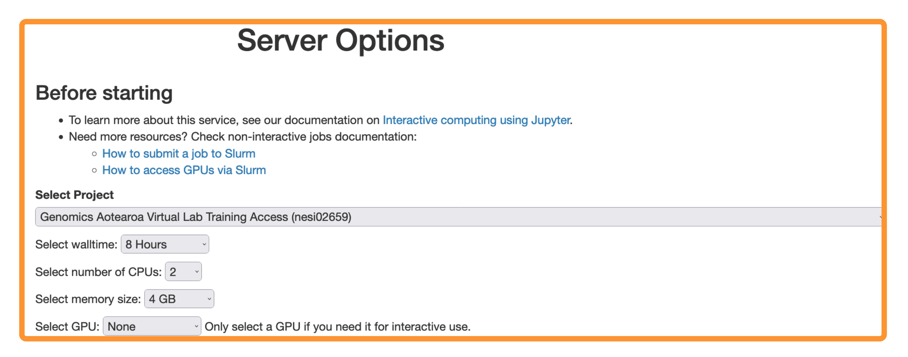

1. Follow https://jupyter.nesi.org.nz/hub/login
2. 
Enter NeSI username, HPC password and 6 digit second factor token 

3. 
Choose server options as below

>>* make sure to choose the correct project code `nesi02659`, number of CPUs `CPUs=4`, memory `8 GB` prior to pressing  button.

 

