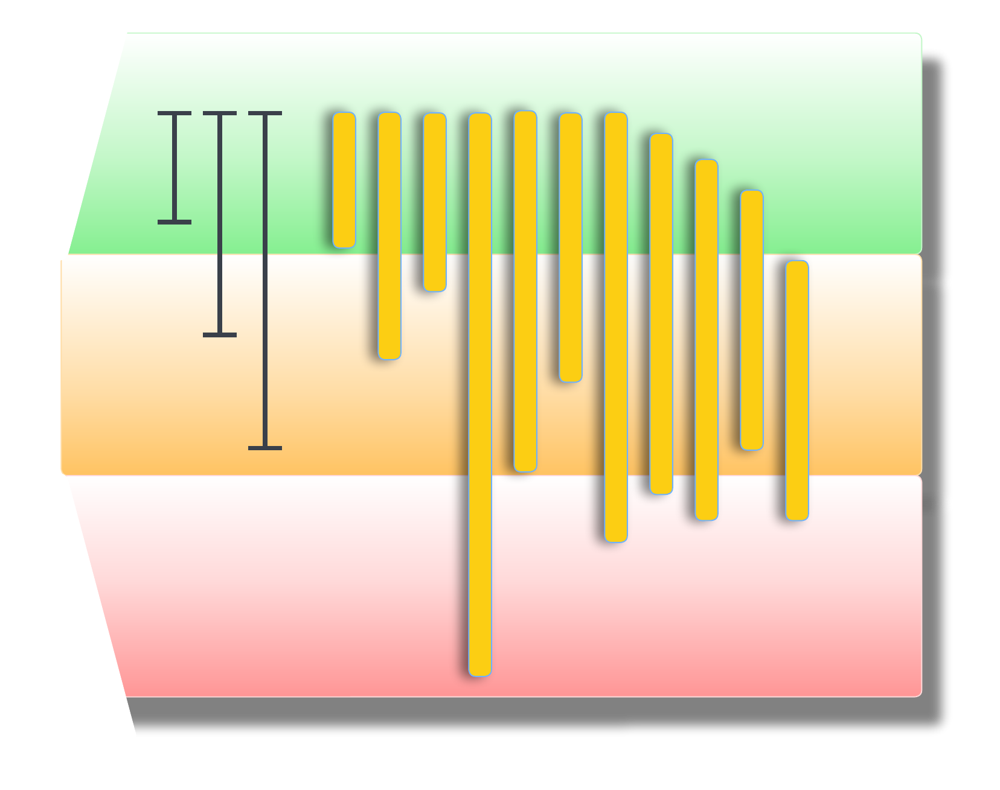

# Quality control of the sequencing data.

!!! info "Objectives"

    - Assess the quality of your data
    - Use FastQC package to do quality check
    - Use MultiQC to view our analysis results


<center>
{width="350"}
</center>


---

Several tools available to do quality assessment. For this workshop, we will use `fastqc`.

First, it is always good to verify where we are:

```bash
cd ~
```
```bash
pwd
```

```
/home/$USER
# good I am ready to work
```

Checking to make sure we have the Raw files for the workshop.

```bash
$ ls
RNA_seq ...
```

Creating a directory where to store the QC data:

```bash
$ cd RNA_seq
```

```bash
$ ls
Genome  Raw  rsmodules.sh  yeast_counts_all_chr.txt
```

```bash
$ mkdir QC
```

Since we are working on the NeSI HPC, we need to search and load the software/application before we can use it.

??? info "Note: Accessing and Deploying software with `module` command""

    * View available modules

    ```bash
    #View all modules
    $ module avail

    # View all modules which match the keyword in their name
    $ module avail KEYWORD

    # View all modules which match the keyword in their name or description
    $ module spider KEYWORD
    ```

    * Load a specific program

        >All module names on NeSI Software stack have a version and toolchain/environment suffixes. If none is specified, then the default version of the software is loaded. The default version can be seen with the `module avail modulename` command (corresponding module name will have `(D)` suffix)

    ```bash
    $ module load Module_Name
    ```


    * Unload all current modules

    ```bash
    $ module purge
    ```
    >Please **do not** use `$module --force purge`

    * Swap a currently loaded module for a different one

    ```bash
    $ module switch CURRENT_MODULE DESIRED_MODULE
    ```

* Search whether the software is available as a module with `module spider` command. 

```bash
module spider fastqc
```

and then load 

```bash
module purge
```
```bash
module load FastQC/0.11.9
```

!!! warning "Warning"
    module name used for `module spider` is case insensitive.i.e. `fastqc` will respond and show the available modules matching the string. However, module name for `module load` command is case sensitive. Therefore, we recommend copying and pasting the name/version of it from the spider list
    

!!! hint "Load all modules at once"

    There is a file named ***rsmodules.sh*** which is a shell script to load the required modules at once. Running <br>`source ~/RNA_seq/rsmodules.sh` command will execute it. 


Now we can start the quality control:

```bash
fastqc -o QC/ Raw/*
```
You will see an automatically updating output message telling you the progress of the analysis. It will start like this:

```
Started analysis of SRR014335-chr1.fastq
Approx 5% complete for SRR014335-chr1.fastq
Approx 10% complete for SRR014335-chr1.fastq
Approx 15% complete for SRR014335-chr1.fastq
Approx 20% complete for SRR014335-chr1.fastq
Approx 25% complete for SRR014335-chr1.fastq
Approx 30% complete for SRR014335-chr1.fastq
Approx 35% complete for SRR014335-chr1.fastq
```

The FastQC program has created several new files within our RNA_seq/QC/ directory.

```bash
$ ls QC
SRR014335-chr1_fastqc.html  SRR014336-chr1_fastqc.zip   SRR014339-chr1_fastqc.html  SRR014340-chr1_fastqc.zip
SRR014335-chr1_fastqc.zip   SRR014337-chr1_fastqc.html  SRR014339-chr1_fastqc.zip   SRR014341-chr1_fastqc.html
SRR014336-chr1_fastqc.html  SRR014337-chr1_fastqc.zip   SRR014340-chr1_fastqc.html  SRR014341-chr1_fastqc.zip
```

## Viewing the FastQC results


## Working with the FastQC text output
Now that we’ve looked at our HTML reports to get a feel for the data, let’s look more closely at the other output files. Go back to the tab in your terminal program that is connected to NeSI and make sure you’re in our results subdirectory.

```bash
cd ~/RNA_seq/QC
```
```
ls
```
```
SRR014335-chr1_fastqc.html  SRR014336-chr1_fastqc.zip   SRR014339-chr1_fastqc.html  SRR014340-chr1_fastqc.zip
SRR014335-chr1_fastqc.zip   SRR014337-chr1_fastqc.html  SRR014339-chr1_fastqc.zip   SRR014341-chr1_fastqc.html
SRR014336-chr1_fastqc.html  SRR014337-chr1_fastqc.zip   SRR014340-chr1_fastqc.html  SRR014341-chr1_fastqc.zip
```
Let's unzip the files to look at the FastQC text file outputs.

```bash
for filename in *.zip
do
unzip $filename
done
```

Inside each unzipped folder, there is a summary text which shows results of the statistical tests done by FastQC

```
ls SRR014335-chr1_fastqc
```
```
    fastqc_data.txt  fastqc.fo  fastqc_report.html	Icons/	Images/  summary.txt
```

Use less to preview the summary.txt file

```
less SRR014335-chr1_fastqc/summary.txt
```

We can make a record of the results we obtained for all our samples by concatenating all of our summary.txt files into a single file using the cat command. We’ll call this fastqc_summaries.txt.

```
cat */summary.txt > ~/RNA_seq/QC/fastqc_summaries.txt 
```

* Have a look at the fastqc_summaries.txt and search for any of the samples that have failed the QC statistical tests.

---

## MultiQC -  multi-sample analysis

!!! quote ""

     - The FastQC analysis is applied to each sample separately, and produces a report for each.
     - The application MultiQC provides a way to combine multiple sets of results (i.e., from MANY 
     different software packages) across multiple samples.
     - To generate `multiqc` results, run the following command in the directory with the output files you want to summarise (e.g., fastqc reports generated above):
    
```bash
module load MultiQC/1.9-gimkl-2020a-Python-3.8.2
```
```
cd ~/RNA_seq/
```
```
mkdir MultiQC
```
```
cd MultiQC
```
```
cp ../QC/* ./
```
```
multiqc .
```
```
ls -F
multiqc_data/  multiqc_report.html
```
The html report shows the MultiQC summary


- - - 

<p align="center"><b><a class="btn" href="https://genomicsaotearoa.github.io/RNA-seq-workshop/" style="background: var(--bs-dark);font-weight:bold">Back to homepage</a></b></p>