# Differential Expression Analysis

### Recap

-   In the last section we worked through the process of quality
    assessment and alignment for RNA-seq data
-   This typically takes place on the command line, but can also be done
    from within R.
-   The end result was the generation of count data (counts of reads
    aligned to each gene, per sample) using the FeatureCounts command
    from Subread/Rsubread.
-   Now that we’ve got count data in R, we can begin our differential
    expression analysis.

### Data set reminder

-   Data obtained from yeast RNA-seq experiment,
    <a href="https://journals.plos.org/plosgenetics/article?id=10.1371/journal.pgen.1000299">Lee
    et al 2008 </a>
-   Wild-type versus RNA degradation mutants
-   Six samples (3 WT / 3 MT)
-   NOTE: since we are dealing with an RNA degradation mutant yeast
    strain, we will see MAJOR transcriptomic differences between the
    wild-type and mutant groups (usually the differences you observe in
    a typical RNA-seq study wouldn’t be this extreme).

 - Slides: [lecture_differential_expression.pdf](https://github.com/GenomicsAotearoa/RNA-seq-workshop/blob/master/4.Differential_Expression/lecture_differential_expression.pdf)


## Getting organised

### Create an RStudio project

**NOTE: skip to the next section (“Count Data”) if you are working
within Jupyter on NeSI**

One of the first benefits we will take advantage of in RStudio is
something called an RStudio Project. An RStudio project allows you to
more easily:

-   Save data, files, variables, packages, etc. related to a specific
    analysis project
-   Restart work where you left off
-   Collaborate, especially if you are using version control such as
    git.

To create a project:

-   Open RStudio and go to the File menu, and click New Project.
-   In the window that opens select Existing Project, and browse to the
    RNA_seq folder.
-   Finally, click Create Project.

*Save source from untitled to `yeast_data.R` and continue saving
regularly as you work.*

### Count data

Note: I have now aligned the data for ALL CHROMOSOMES and generated
counts, so we are working with data from all 7127 genes.

*Let’s look at our data set and perform some basic checks before we do a
differential expression analysis.*

```r
library(dplyr)
fcData = read.table('yeast_counts_all_chr.txt', sep='\t', header=TRUE)
fcData %>% head()
```

    ##      Geneid Chr Start   End Strand Length ...STAR.SRR014335.Aligned.out.sam
    ## 1   YDL248W  IV  1802  2953      +   1152                                52
    ## 2 YDL247W-A  IV  3762  3836      +     75                                 0
    ## 3   YDL247W  IV  5985  7814      +   1830                                 2
    ## 4   YDL246C  IV  8683  9756      -   1074                                 0
    ## 5   YDL245C  IV 11657 13360      -   1704                                 0
    ## 6   YDL244W  IV 16204 17226      +   1023                                 6
    ##   ...STAR.SRR014336.Aligned.out.sam ...STAR.SRR014337.Aligned.out.sam
    ## 1                                46                                36
    ## 2                                 0                                 0
    ## 3                                 4                                 2
    ## 4                                 0                                 1
    ## 5                                 3                                 0
    ## 6                                 6                                 5
    ##   ...STAR.SRR014339.Aligned.out.sam ...STAR.SRR014340.Aligned.out.sam
    ## 1                                65                                70
    ## 2                                 0                                 1
    ## 3                                 6                                 8
    ## 4                                 1                                 2
    ## 5                                 5                                 7
    ## 6                                20                                30
    ##   ...STAR.SRR014341.Aligned.out.sam
    ## 1                                78
    ## 2                                 0
    ## 3                                 5
    ## 4                                 0
    ## 5                                 4
    ## 6                                19

Check dimensions:

``` r
dim(fcData)
```

    ## [1] 7127   12

``` r
names(fcData)
```

    ##  [1] "Geneid"                            "Chr"                              
    ##  [3] "Start"                             "End"                              
    ##  [5] "Strand"                            "Length"                           
    ##  [7] "...STAR.SRR014335.Aligned.out.sam" "...STAR.SRR014336.Aligned.out.sam"
    ##  [9] "...STAR.SRR014337.Aligned.out.sam" "...STAR.SRR014339.Aligned.out.sam"
    ## [11] "...STAR.SRR014340.Aligned.out.sam" "...STAR.SRR014341.Aligned.out.sam"

Rename data columns to reflect group membership

``` r
names(fcData)[7:12] = c("WT1", "WT2", "WT3", "MT1", "MT2", "MT3")
 
fcData %>% head()
```

    ##      Geneid Chr Start   End Strand Length WT1 WT2 WT3 MT1 MT2 MT3
    ## 1   YDL248W  IV  1802  2953      +   1152  52  46  36  65  70  78
    ## 2 YDL247W-A  IV  3762  3836      +     75   0   0   0   0   1   0
    ## 3   YDL247W  IV  5985  7814      +   1830   2   4   2   6   8   5
    ## 4   YDL246C  IV  8683  9756      -   1074   0   0   1   1   2   0
    ## 5   YDL245C  IV 11657 13360      -   1704   0   3   0   5   7   4
    ## 6   YDL244W  IV 16204 17226      +   1023   6   6   5  20  30  19

Extract count data

-   Remove annotation columns
-   Add row names

``` r
counts = fcData[, 7:12]
rownames(counts) = fcData$Geneid
counts %>% head()
```

    ##           WT1 WT2 WT3 MT1 MT2 MT3
    ## YDL248W    52  46  36  65  70  78
    ## YDL247W-A   0   0   0   0   1   0
    ## YDL247W     2   4   2   6   8   5
    ## YDL246C     0   0   1   1   2   0
    ## YDL245C     0   3   0   5   7   4
    ## YDL244W     6   6   5  20  30  19

#### Visualising the data

Data are highly skewed (suggests that logging might be useful):

``` r
boxplot(as.matrix(counts) ~ col(counts))
```

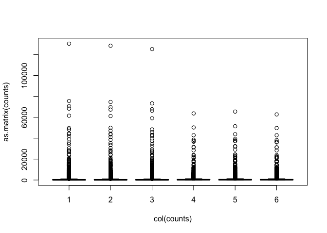<!-- -->

Some genes have zero counts:

``` r
colSums(counts==0)
```

    ## WT1 WT2 WT3 MT1 MT2 MT3 
    ## 562 563 573 437 425 435

Log transformation (add 0.5 to avoid log(0) issues):

``` r
logCounts = log2(as.matrix(counts)+ 0.5)
```

Now we can see the per-sample distributions more clearly:

``` r
boxplot(as.matrix(logCounts) ~ col(logCounts))
```

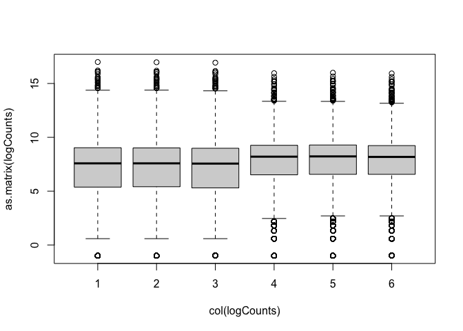<!-- -->

Density plots are also a good way to visualise the data:

``` r
lineColour <- c("blue", "blue", "blue", "red", "red", "red")
lineColour
```

    ## [1] "blue" "blue" "blue" "red"  "red"  "red"

``` r
plot(density(logCounts[,1]), ylim=c(0,0.3), col=lineColour[1])
for(i in 2:ncol(logCounts)) lines(density(logCounts[,i]), col=lineColour[i])
```

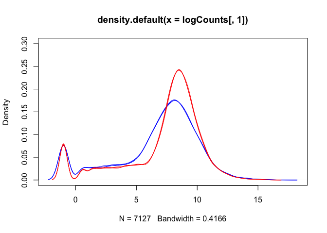<!-- -->

The boxplots and density plots show clear differences between the sample
groups - are these biological, or experimental artifacts? (often we
don’t know).

**Remember: the wild-type and mutant yeast strains are VERY different.
You wouldn’t normally see this amount of difference in the distributions
between the groups.**

#### Read counts per sample

Normalisation process (slightly different for each analysis method)
takes “library size” (number of reads generated for each sample) into
account.

-   A good blog about normalization:
    <a href="https://www.reneshbedre.com/blog/expression_units.html">Link</a>

``` r
colSums(counts)
```

    ##     WT1     WT2     WT3     MT1     MT2     MT3 
    ## 4915975 4892227 4778158 4618409 4719413 4554283

Visualise via bar plot

``` r
colSums(counts) %>% barplot(., ylab="Reads mapped per sample")
```

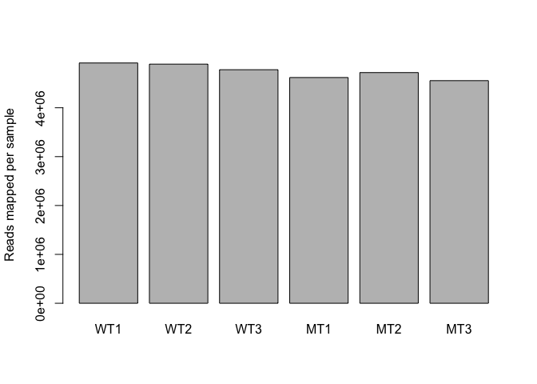<!-- -->

*Now we are ready for differential expression analysis*

## Detecting differential expression:

We are going to identify genes that are differential expressed using 3
different packages (time allowing) and compare the results.

But first, lets take a brief aside, and talk about the process of
detecting genes that have undergone a statistically significance change
in expression between the two groups.

**GO BACK TO THE README PAGE, AND OPEN UP THE PDF DOCUMENT**

------------------------------------------------------------------------

### Limma

<!-- NEED TO EXPLAIN "TREND=TRUE" -->

-   Limma can be used for analysis, by transforming the RNA-seq count
    data in an appropriate way (log-scale normality-based assumption
    rather than Negative Binomial for count data)
-   Use data transformation and log to satisfy normality assumptions
    (CPM = Counts per Million).

``` r
library(limma)
library(edgeR)

dge <- DGEList(counts=counts)
dge <- calcNormFactors(dge)
logCPM <- cpm(dge, log=TRUE, prior.count=3)

options(width=100)
head(logCPM, 3)
```

    ##                  WT1        WT2        WT3        MT1        MT2        MT3
    ## YDL248W    3.7199528  3.5561232  3.2538405  3.6446399  3.7156488  3.9155366
    ## YDL247W-A -0.6765789 -0.6765789 -0.6765789 -0.6765789 -0.3140297 -0.6765789
    ## YDL247W    0.1484688  0.6727144  0.1645731  0.7843936  1.0395626  0.6349276

#### Aside: RPKM

We can use R to generate RPKM values (or FPKM if using paired-end
reads):

-   Need gene length information to do this
-   Can get this from`goseq` package (we’ll use this later for our
    pathway analysis)

``` r
library(goseq)
geneLengths = getlength(rownames(counts), "sacCer2","ensGene")
rpkmData <- rpkm(dge, geneLengths)
rpkmData %>% round(., 2) %>% head()
```

    ##             WT1  WT2  WT3   MT1   MT2   MT3
    ## YDL248W   10.89 9.66 7.73 10.30 10.85 12.55
    ## YDL247W-A  0.00 0.00 0.00  0.00  2.35  0.00
    ## YDL247W    0.26 0.53 0.27  0.60  0.78  0.51
    ## YDL246C    0.00 0.00 0.23  0.17  0.33  0.00
    ## YDL245C    0.00 0.43 0.00  0.54  0.73  0.44
    ## YDL244W    1.41 1.42 1.21  3.57  5.24  3.44

``` r
range(rpkmData, na.rm=TRUE)
```

    ## [1]     0.00 69786.58

Compare RPKM to logCPM

``` r
par(mfrow=c(2,3))
for(i in 1:ncol(rpkmData)){
  plot(logCPM[,i], log2(rpkmData[,i]), pch='.', 
       xlab="logCPM", ylab="RPKM", main=colnames(logCPM)[i])
}
```

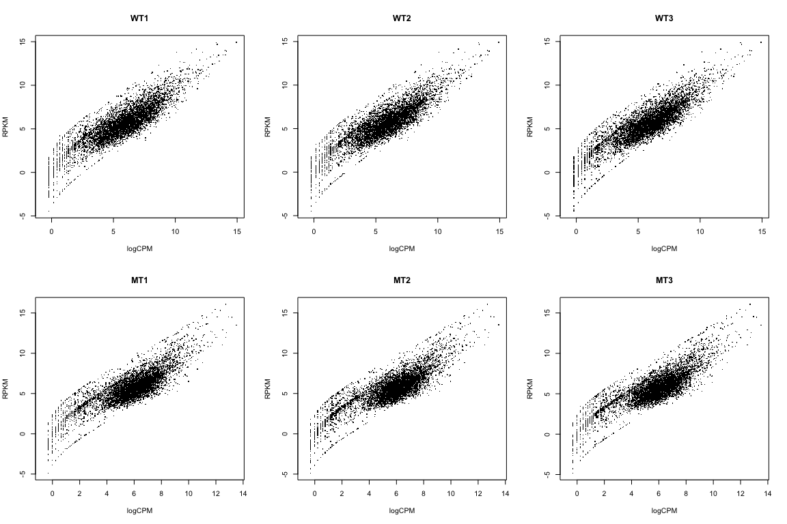<!-- -->

**We’re NOT going to use RPKM data here. I just wanted to show you how
to calculate it, and how it relates to the logCPM data**

### Back to the analysis… (using logCPM)

What if we just did a t-test?

``` r
## The beeswarm package is great for making jittered dot plots
library(beeswarm)

# Specify "conditions" (groups: WT and MT)
conds <- c("WT","WT","WT","MT","MT","MT")

## Perform t-test for "gene number 6" (because I like that one...)
t.test(logCPM[6,] ~ conds)
```

    ## 
    ##  Welch Two Sample t-test
    ## 
    ## data:  logCPM[6, ] by conds
    ## t = 7.0124, df = 2.3726, p-value = 0.01228
    ## alternative hypothesis: true difference in means is not equal to 0
    ## 95 percent confidence interval:
    ##  0.5840587 1.9006761
    ## sample estimates:
    ## mean in group MT mean in group WT 
    ##         2.244310         1.001943

``` r
beeswarm(logCPM[6,] ~ conds, pch=16, ylab="Expression (logCPM)", xlab="Group",
         main=paste0(rownames(logCPM)[6], ": MT vs WT"))
```

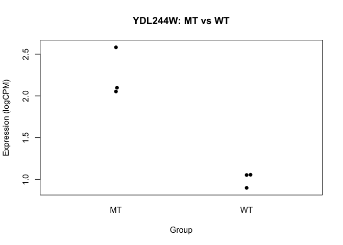<!-- -->

-   we basically want to do this sort of analysis, for every gene
-   we’ll use a slightly more sophisticated approach though

However, before we get to statistical testing, we (might) first need to
do a little bit more normalisation.

### Limma: voom

-   The “voom” function estimates relationship between the mean and the
    variance of the logCPM data, normalises the data, and creates
    “precision weights” for each observation that are incorporated into
    the limma analysis.

``` r
design <- model.matrix(~conds)
design
```

    ##   (Intercept) condsWT
    ## 1           1       1
    ## 2           1       1
    ## 3           1       1
    ## 4           1       0
    ## 5           1       0
    ## 6           1       0
    ## attr(,"assign")
    ## [1] 0 1
    ## attr(,"contrasts")
    ## attr(,"contrasts")$conds
    ## [1] "contr.treatment"

``` r
v <- voom(dge, design, plot=TRUE)
```

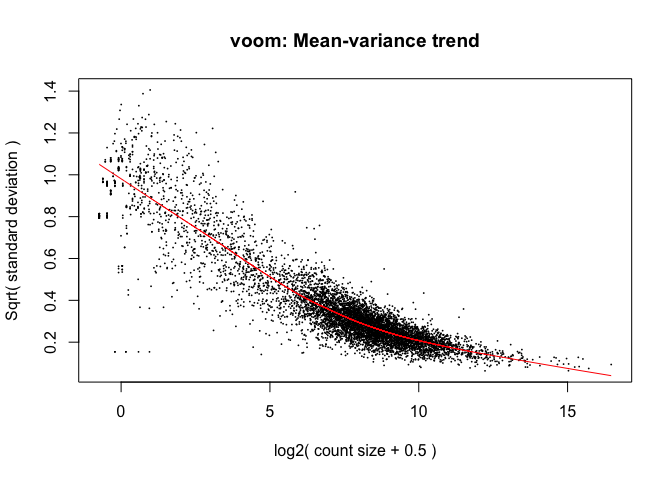<!-- -->

<!--  -->

#### Voom: impact on samples

Mainly affects the low-end (low abundance genes)

``` r
par(mfrow=c(2,3))
for(i in 1:ncol(logCPM)){
  plot(logCPM[,i], v$E[,i], xlab="LogCPM",
       ylab="Voom",main=colnames(logCPM)[i])
  abline(0,1)
}
```

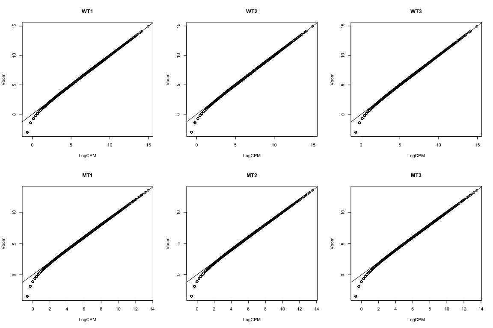<!-- -->

Hasn’t removed the differences between the groups

``` r
boxplot(v$E ~ col(v$E))
```

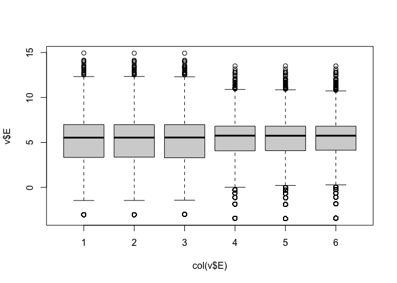<!-- -->

``` r
lineColour <- ifelse(conds=="MT", "red", "blue")
lineColour
```

    ## [1] "blue" "blue" "blue" "red"  "red"  "red"

``` r
plot(density(v$E[,1]), ylim=c(0,0.3), col=lineColour[1])
for(i in 2:ncol(logCPM)) lines(density(v$E[,i]), col=lineColour[i])
```

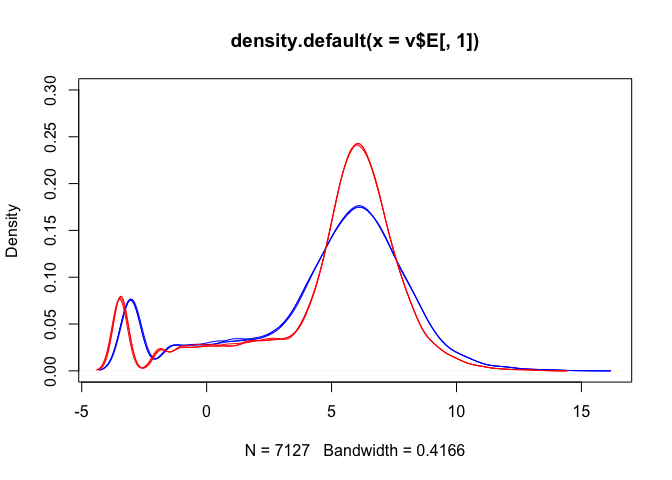<!-- -->

We can deal with this via “quantile normalisation”. Specify

    normalize="quantile"

in the `voom` function.

``` r
q <- voom(dge, design, plot=TRUE, normalize="quantile")
```

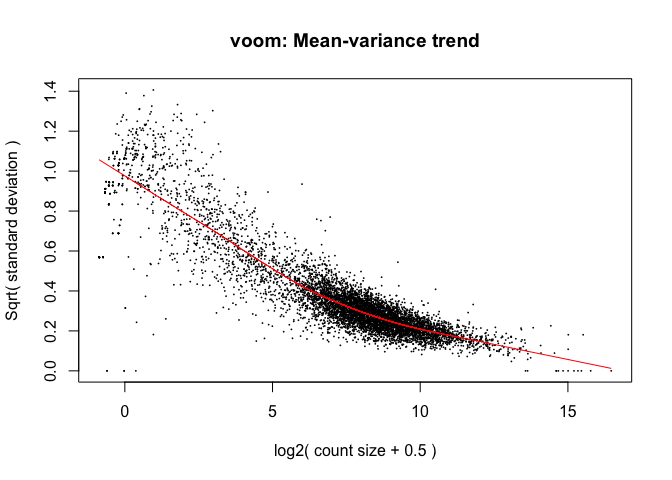<!-- -->

Quantile normalisation forces all of the distributions to be the same.

-   it is a strong assumption, and can have a major impact on the
    analysis
-   potentially removing biological differences between groups.

``` r
par(mfrow=c(2,3))
for(i in 1:ncol(logCPM)){
  plot(logCPM[,i], q$E[,i], xlab="LogCPM",
       ylab="Voom (+quantile norm)",main=colnames(logCPM)[i])
  abline(0,1)
}
```

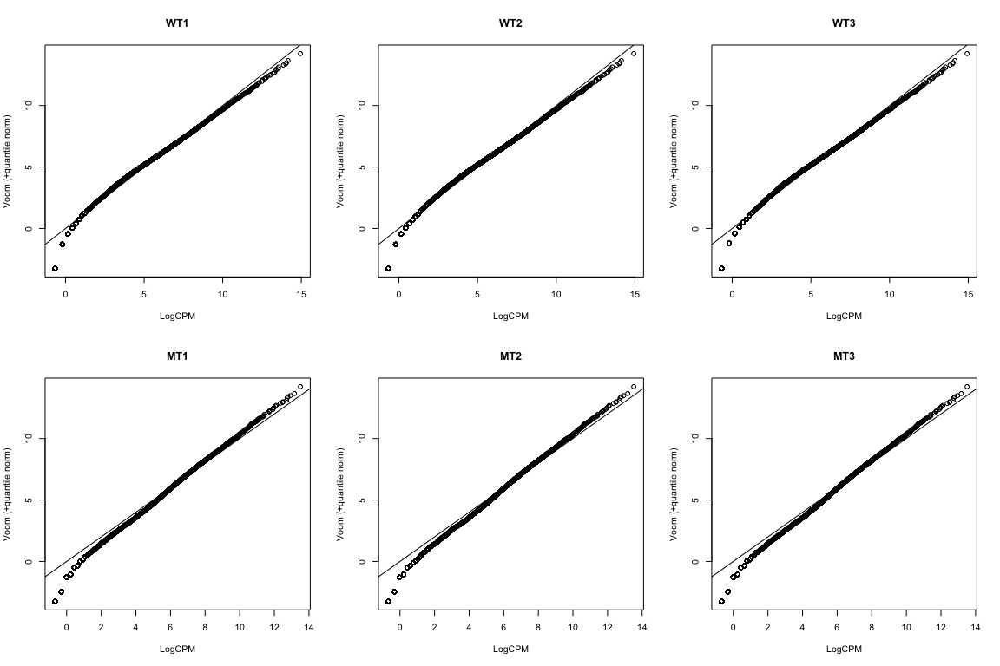<!-- -->

``` r
boxplot(q$E ~ col(q$E))
```

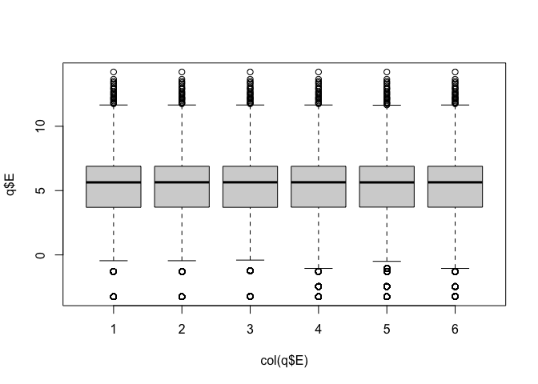<!-- -->

``` r
lineColour <- ifelse(conds=="MT", "red", "blue")
lineColour
```

    ## [1] "blue" "blue" "blue" "red"  "red"  "red"

``` r
plot(density(q$E[,1]), ylim=c(0,0.3), col=lineColour[1])
for(i in 2:ncol(logCPM)) lines(density(q$E[,i]), col=lineColour[i])
```

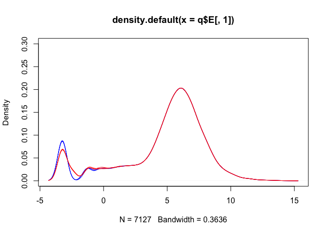<!-- -->

**Note: we’re NOT going to use the quantile normalised data here, but I
wanted to show you how that method works.**

### Statistical testing: fitting a linear model

The next step is to fit a linear model to the transformed count data.

The `lmFit()` command does this *for each gene* (all at once).

``` r
fit <- lmFit(v, design)
```

The `eBayes()` function then performs Emprical Bays shrinkage estimation
to adjust the variability estimates for each gene, and produce the
moderated t-statistics.

``` r
fit <- eBayes(fit)
```

We then summarize this information using the `topTable()` function,
which list the genes in order of the strength of statistical support for
differential expression (i.e., genes with lowest p-values are at the top
of the list):

``` r
tt <- topTable(fit, coef=ncol(design), n=nrow(counts))
head(tt)
```

    ##            logFC  AveExpr        t      P.Value    adj.P.Val        B
    ## YAL038W 2.313985 10.80214 319.5950 3.725452e-13 8.850433e-10 21.08951
    ## YOR161C 2.568389 10.80811 321.9628 3.574510e-13 8.850433e-10 21.08187
    ## YML128C 1.640664 11.40819 286.6167 6.857932e-13 9.775297e-10 20.84520
    ## YMR105C 2.772539  9.65092 331.8249 3.018547e-13 8.850433e-10 20.16815
    ## YHL021C 2.034496 10.17510 269.4034 9.702963e-13 1.152550e-09 20.07857
    ## YDR516C 2.085424 10.05426 260.8061 1.163655e-12 1.184767e-09 19.87217

#### Significant genes

Adjusted p-values less than 0.05:

``` r
sum(tt$adj.P.Val < 0.05)
```

    ## [1] 5140

Adjusted p-values less than 0.01:

``` r
sum(tt$adj.P.Val <= 0.01)
```

    ## [1] 4566

By default, limma uses FDR adjustment (but lets check):

``` r
sum(p.adjust(tt$P.Value, method="fdr") <= 0.01)
```

    ## [1] 4566

Volcano plots are a popular method for summarising the `limma` output:

``` r
volcanoplot(fit, coef=2)
abline(h=-log10(0.05))
```

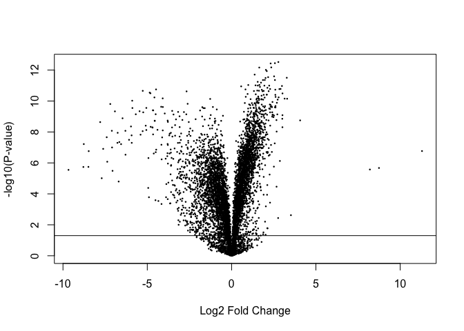<!-- -->

Significantly DE genes:

``` r
sigGenes = which(tt$adj.P.Val <= 0.05)
length(sigGenes)
```

    ## [1] 5140

``` r
volcanoplot(fit, coef=2)
points(tt$logFC[sigGenes], -log10(tt$P.Value[sigGenes]), col='red', pch=16, cex=0.5)
```

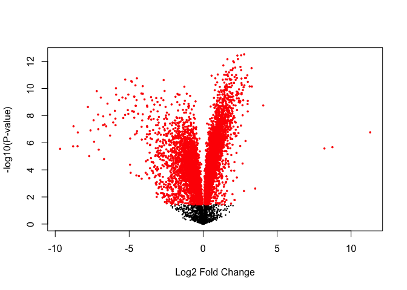<!-- -->

Significantly DE genes above fold-change threshold:

``` r
sigGenes = which(tt$adj.P.Val <= 0.05 & (abs(tt$logFC) > log2(2)))
length(sigGenes)
```

    ## [1] 1891

``` r
volcanoplot(fit, coef=2)
points(tt$logFC[sigGenes], -log10(tt$P.Value[sigGenes]), col='red', pch=16, cex=0.5)
```

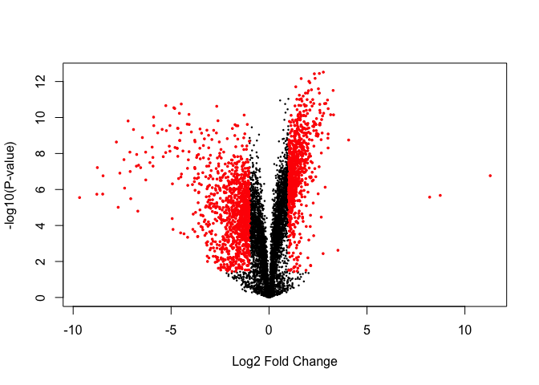<!-- -->

Get the rows of top table with significant adjusted p-values - we’ll
save these for later to compare with the other methods.

``` r
limmaPadj <- tt[tt$adj.P.Val <= 0.01, ]
```

------------------------------------------------------------------------

### DESeq2

-   The DESeq2 package uses the *Negative Binomial* distribution to
    model the count data from each sample.
-   A statistical test based on the Negative Binomial distribution (via
    a generalized linear model, GLM) can be used to assess differential
    expression for each gene.
-   Use of the Negative Binomial distribution attempts to accurately
    capture the variation that is observed for count data.

More information about DESeq2:
<a href="https://genomebiology.biomedcentral.com/articles/10.1186/s13059-014-0550-8">article
by Love et al, 2014</a>

Set up “DESeq object” for analysis:

``` r
library(DESeq2)
dds <- DESeqDataSetFromMatrix(countData = as.matrix(counts), 
                              colData = data.frame(conds=factor(conds)), 
                              design = formula(~conds))
```

Can access the count data in teh `dds` object via the `counts()`
function:

``` r
counts(dds) %>% head()
```

    ##           WT1 WT2 WT3 MT1 MT2 MT3
    ## YDL248W    52  46  36  65  70  78
    ## YDL247W-A   0   0   0   0   1   0
    ## YDL247W     2   4   2   6   8   5
    ## YDL246C     0   0   1   1   2   0
    ## YDL245C     0   3   0   5   7   4
    ## YDL244W     6   6   5  20  30  19

Fit DESeq model to identify DE transcripts

``` r
dds <- DESeq(dds)
```

Take a look at the results table

``` r
res <- DESeq2::results(dds)
knitr::kable(res[1:6,])
```

|           |   baseMean | log2FoldChange |     lfcSE |       stat |    pvalue |      padj |
|:----------|-----------:|---------------:|----------:|-----------:|----------:|----------:|
| YDL248W   | 56.2230316 |     -0.2339470 | 0.2278417 | -1.0267961 | 0.3045165 | 0.3663639 |
| YDL247W-A |  0.1397714 |     -0.5255769 | 4.0804729 | -0.1288030 | 0.8975136 | 0.9173926 |
| YDL247W   |  4.2428211 |     -0.8100552 | 0.8332543 | -0.9721584 | 0.3309718 | 0.3948536 |
| YDL246C   |  0.6182409 |     -1.0326364 | 2.1560899 | -0.4789394 | 0.6319817 | 0.6915148 |
| YDL245C   |  2.8486580 |     -1.9781751 | 1.1758845 | -1.6822869 | 0.0925132 | 0.1230028 |
| YDL244W   | 13.0883354 |     -1.5823354 | 0.5128788 | -3.0852037 | 0.0020341 | 0.0032860 |

Summary of differential gene expression

``` r
summary(res) 
```

    ## 
    ## out of 6830 with nonzero total read count
    ## adjusted p-value < 0.1
    ## LFC > 0 (up)       : 2520, 37%
    ## LFC < 0 (down)     : 2521, 37%
    ## outliers [1]       : 0, 0%
    ## low counts [2]     : 0, 0%
    ## (mean count < 0)
    ## [1] see 'cooksCutoff' argument of ?results
    ## [2] see 'independentFiltering' argument of ?results

Note: p-value adjustment

-   The “padj” column of the DESeq2 results (`res`) contains adjusted
    p-values (FDR).
-   Can use the `p.adjust` function to manually adjust the DESeq2
    p-values if needed (e.g., to use Holm correction)

``` r
# Remove rows with NAs
res = na.omit(res)

# Get the rows of "res" with significant adjusted p-values
resPadj<-res[res$padj <= 0.05 , ]

# Get dimensions
dim(resPadj)
```

    ## [1] 4811    6

Number of adjusted p-values less than 0.05

``` r
sum(res$padj <= 0.05)
```

    ## [1] 4811

Check that this is the same using p.adjust with FDR correction

``` r
sum(p.adjust(res$pvalue, method="fdr") <= 0.05)
```

    ## [1] 4811

Number of Holm adjusted p-values less than 0.05

``` r
sum(p.adjust(res$pvalue, method="holm") <= 0.01)
```

    ## [1] 3429

Sort summary list by p-value and save the table as a CSV file that can
be read in Excel (or any other spreadhseet program).

``` r
res <- res[order(res$padj),]

write.csv(as.data.frame(res),file='deseq2.csv')
```

------------------------------------------------------------------------

### edgeR

-   The edgeR package also uses the negative binomial distribution to
    model the RNA-seq count data.
-   Takes an empirical Bayes approach to the statistical analysis, in a
    similar way to how the `limma` package handles RNA-seq data.

#### Identify DEGs with edgeR’s “Exact” Method

Load `edgeR` package

``` r
library(edgeR)
```

Construct `DGEList` object

``` r
y <- DGEList(counts=counts, group=conds)
```

Calculate library size (counts per sample)

``` r
y <- calcNormFactors(y)
```

Estimate common dispersion (overall variability)

``` r
y <- estimateCommonDisp(y)
```

Estimate tagwise dispersion (per gene variability)

``` r
y <- estimateTagwiseDisp(y)
```

#### edgeR analysis and output

Compute exact test for the negative binomial distribution.

``` r
et <- exactTest(y) 

knitr::kable(topTags(et, n=4)$table)
```

|         |     logFC |    logCPM | PValue | FDR |
|:--------|----------:|----------:|-------:|----:|
| YCR077C | 13.098599 |  6.629306 |      0 |   0 |
| snR71   | -9.870811 |  8.294459 |      0 |   0 |
| snR59   | -8.752555 | 10.105453 |      0 |   0 |
| snR53   | -8.503101 |  7.687908 |      0 |   0 |

*Adjusted p-values*

``` r
edge <- as.data.frame(topTags(et, n=nrow(counts))) 
sum(edge$FDR <= 0.05)
```

    ## [1] 5242

``` r
sum(p.adjust(edge$PValue, method="fdr") <= 0.05)
```

    ## [1] 5242

Get the rows of “edge” with significant adjusted p-values

``` r
edgePadj <- edge[edge$FDR <= 0.05, ]
```

### DESeq2 vs edgeR

Generate Venn diagram to compare DESeq2 and edgeR results.

There is fairly good overlap:

``` r
library(gplots)
setlist <- list(edgeRexact=rownames(edgePadj), DESeq2=rownames(resPadj))
venn(setlist)
```

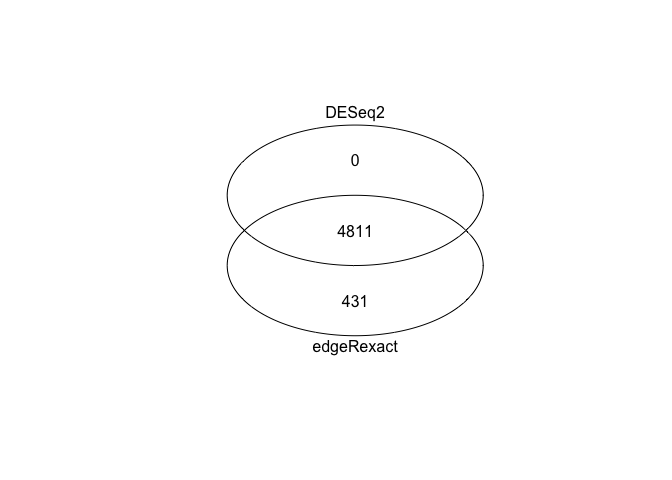<!-- -->

------------------------------------------------------------------------

### Limma vs edgeR vs DESeq2

Again, fairly good overlap across the three methods we’ve looked at:

``` r
setlist <- list(edgeRexact=rownames(edgePadj), 
                DESeq2=rownames(resPadj),
                LimmaVoom=rownames(limmaPadj))
venn(setlist)
```

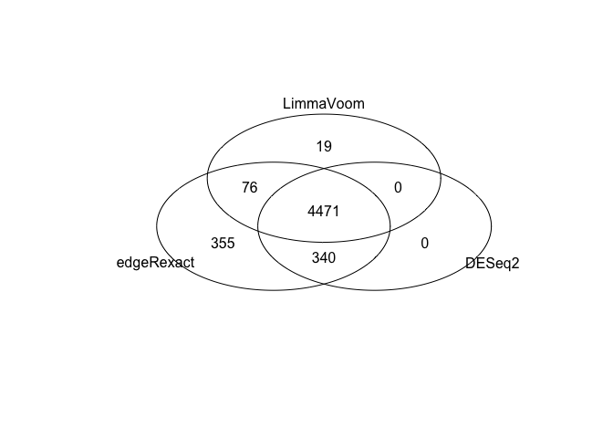<!-- -->

### Summary

-   Once we’ve generated count data, there are a number of ways to
    perform a differential expression analysis.
    -   DESeq2 and edgeR model the count data, and assume a Negative
        Binomial distribution
    -   Limma transforms (and logs) the data and assumes normality
-   Here we’ve seen that these three approaches give quite similar
    results.
-   The next step in a “standard” RNA-seq workflow is to perform
    “pathway analysis”.

#### Save limma topTable results for next session…

``` r
save(list='tt', file='topTable.RData')
```
- - - 

<p style="text-align:left;">
  <b><a class="btn" href="https://genomicsaotearoa.github.io/RNA-seq-workshop/3.Mapping_And_Count/" style="background: var(--bs-green);font-weight:bold">&laquo; 3. Mapping and Counting</a></b> 
  <span style="float:right;">
    <b><a class="btn" href="https://genomicsaotearoa.github.io/RNA-seq-workshop/5.Overrepresentation_Analysis/rnaseq-pathway.html" style="background: var(--bs-green);font-weight:bold">5. Over-representation analysis &raquo;</a></b>
  </span>
</p>

<p align="center"><b><a class="btn" href="https://genomicsaotearoa.github.io/RNA-seq-workshop/" style="background: var(--bs-dark);font-weight:bold">Back to homepage</a></b></p>