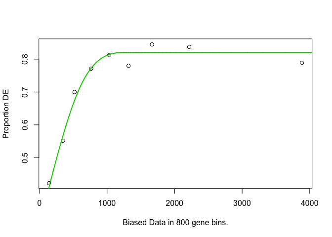
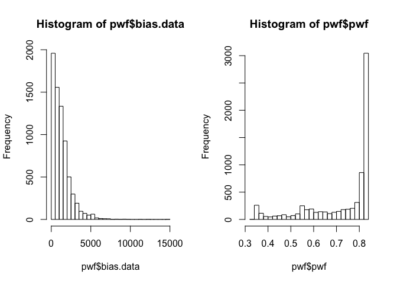
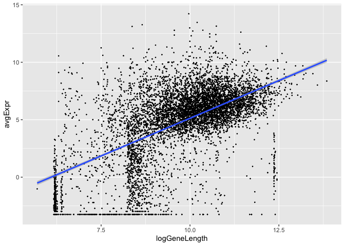

# Over-representation analysis (Gene Ontology)

!!! info "Objectives"

<center>
{width="250"}
</center>

 - Slides: [lecture_annotation_pathways.pdf](https://github.com/GenomicsAotearoa/RNA-seq-workshop/blob/master/5.Overrepresentation_Analysis/lecture_annotation_pathways.pdf)


Over-representation Analysis
(<a href="https://academic.oup.com/bioinformatics/article/20/18/3710/202612">Boyle
et al. 2004</a>) is a widely used approach to determine whether known
biological functions or processes are over-represented (= enriched) in
an experimentally-derived gene list, e.g. a list of differentially
expressed genes (DEGs).

-   Can perform overrepresentation analysis online (e.g., Enrichr,
    GeneSetDB, PantherDB), and also in R.
-   The basic principles are to:
    -   identify a collection of differentially expressed genes
    -   test to see if genes that are members of specific gene sets
        (e.g., Reactome pathways, Gene Ontology categories) are
        differentially expressed more often than would be expected by
        chance.

*Some caveats for RNA-seq data*

-   The gene-set analysis methods are applicable to transcriptomic data
    from both microarrays and RNA-seq.
-   One caveat, however, is that the results need to take *gene length*
    into account.
-   RNA-seq tends to produce higher expression levels (i.e., greater
    counts) for longer genes: a longer transcript implies more aligned
    fragments, and thus higher counts. This also gives these genes a
    great chance of being statistically differentially expressed.
-   Some gene sets (pathways, GO terms) tend to involve families of long
    genes: if long genes have a great chance of being detected as
    differentially expressed, then *gene sets* consisting of long genes
    will have a great chance of appeared to be enriched in the analysis.

### GOseq

-   The GOseq methodology
    (<a href="https://genomebiology.biomedcentral.com/articles/10.1186/gb-2010-11-2-r14">Young
    et al., 2010</a>) overcomes this issue by allowing the
    over-representation analysis to be adjusted for gene length.
-   modification to hypergeometric sampling probability
-   exact method (resampling) and an approximation-based method
-   More recent publications have also applied this gene-length
    correction to GSEA-based methods.
-   Still not widely understood to be an issue when performing RNA-seq
    pathway analysis, but REALLY important to take into account.

#### Results from the Young et al (2010) publication:


<center><small>Proportion DE by gene length and reads</small></center>


<center><small>Gene set ranks by standard analysis</small></center>


<center><small>Gene set ranks by GOseq</small></center>


### GOseq analysis

Need to figure out if our organism is supported… (code is “sacCer”)

``` r
library(dplyr)
library(goseq)
supportedOrganisms() %>% head()
```

    ##          Genome         Id  Id Description Lengths in geneLeneDataBase
    ## 10      anoCar1    ensGene Ensembl gene ID                        TRUE
    ## 11      anoGam1    ensGene Ensembl gene ID                        TRUE
    ## 132     anoGam3                                                  FALSE
    ## 12      apiMel2    ensGene Ensembl gene ID                        TRUE
    ## 137 Arabidopsis                                                  FALSE
    ## 56      bosTau2 geneSymbol     Gene Symbol                        TRUE
    ##     GO Annotation Available
    ## 10                    FALSE
    ## 11                     TRUE
    ## 132                    TRUE
    ## 12                    FALSE
    ## 137                    TRUE
    ## 56                     TRUE

Easier to find if we use `View()` **(NB - this only works in RStudio.
Can’t use in Jupyter on NeSI).**

``` r
supportedOrganisms() %>% View()
```

*Define differentially expressed genes*

-   Create a vector of 0’s and 1’s to denote whether or not genes are
    differentially expressed (limma analysis: topTable).
-   Add gene names to the vector so that GOSeq knows which gene each
    data point relates to.

Load our topTable results from last session:

``` r
load('topTable.RData')
```

``` r
# Note: If you want to use tt from DESeq, replace $adj.P.Val with $padj below

genes <- ifelse(tt$adj.P.Val < 0.05, 1, 0) 
names(genes) <- rownames(tt)
head(genes)
```

    ## YAL038W YOR161C YML128C YMR105C YHL021C YDR516C 
    ##       1       1       1       1       1       1

``` r
table(genes)
```

    ## genes
    ##    0    1 
    ## 1987 5140

#### Calculate gene weights

-   Put genes into length-based “bins”, and plot length vs proportion
    differentially expressed
-   Likely restricts to only those genes with GO annotation

``` r
pwf=nullp(genes, "sacCer1", "ensGene")
```

<!-- -->

#### Inspect output

Report length (bias) and weight data per gene.

``` r
head(pwf)
```

    ##         DEgenes bias.data       pwf
    ## YAL038W       1      1504 0.8205505
    ## YOR161C       1      1621 0.8205505
    ## YML128C       1      1543 0.8205505
    ## YMR105C       1      1711 0.8205505
    ## YHL021C       1      1399 0.8205505
    ## YDR516C       1      1504 0.8205505

#### Gene lengths and weights

``` r
par(mfrow=c(1,2))
hist(pwf$bias.data,30)
hist(pwf$pwf,30)
```

<!-- -->

<!--  -->

#### Gene length vs average expression

Is there an association between gene length and expression level?

``` r
library(ggplot2)
data.frame(logGeneLength = log2(pwf$bias.data), 
           avgExpr = tt$AveExpr) %>% 
  ggplot(., aes(x=logGeneLength, y=avgExpr)) + 
  geom_point(size=0.2) + 
  geom_smooth(method='lm')
```

<!-- -->

How about gene length and statistical evidence supporting differential
expression?

(Kinda hard to see, but it is apparently there…)

``` r
data.frame(logGeneLength = log2(pwf$bias.data), 
           negLogAdjP = -log10(tt$adj.P.Val)) %>% 
  ggplot(., aes(x=logGeneLength, negLogAdjP)) + 
  geom_point(size=0.2) + 
  geom_smooth(method='lm')
```

<!-- -->

<!--  -->

#### Length correction in GOSeq

-   Uses “Wallenius approximation” to perform correction.
-   Essentially it is performing a weighted Fisher’s Exact Test, but
    each gene in the 2x2 data does not contribute equally to the per
    cell count - it instead contributes its weight (based on its
    length).
-   This means that a gene set (e.g., GO term) containing lots of
    significant short genes will be considered more likely to be
    enriched that a gene set with a similar proportion of long genes
    that are differentially expressed.

Run GOSeq with gene length correction:

``` r
GO.wall=goseq(pwf, "sacCer1", "ensGene")
```

#### Output: Wallenius method

``` r
head(GO.wall)
```

    ##        category over_represented_pvalue under_represented_pvalue numDEInCat
    ## 1325 GO:0005622            1.817597e-17                        1       4298
    ## 7912 GO:0110165            8.200109e-12                        1       4456
    ## 5245 GO:0042254            9.441146e-12                        1        364
    ## 3817 GO:0022613            1.355385e-11                        1        439
    ## 5446 GO:0043226            2.516156e-11                        1       3826
    ## 5449 GO:0043229            4.433252e-11                        1       3817
    ##      numInCat                                 term ontology
    ## 1325     5179                        intracellular       CC
    ## 7912     5417           cellular anatomical entity       CC
    ## 5245      395                  ribosome biogenesis       BP
    ## 3817      482 ribonucleoprotein complex biogenesis       BP
    ## 5446     4609                            organelle       CC
    ## 5449     4599              intracellular organelle       CC

#### P-value adjustment

``` r
GO.wall.padj <- p.adjust(GO.wall$over_represented_pvalue, method="fdr")
sum(GO.wall.padj < 0.05)
```

    ## [1] 45

``` r
GO.wall.sig <- GO.wall$category[GO.wall.padj < 0.05]
length(GO.wall.sig)
```

    ## [1] 45

``` r
head(GO.wall.sig)
```

    ## [1] "GO:0005622" "GO:0110165" "GO:0042254" "GO:0022613" "GO:0043226"
    ## [6] "GO:0043229"

#### Filtering by gene set length

We are usually not interested in pathways or ontology terms that involve
large numbers of genes (they are often rather broad terms or
mechanisms), so we can exclude these from the results (here we only
include significant GO terms that involve less than 500 genes):

``` r
GO.wall[GO.wall.padj < 0.05, ] %>% filter(numInCat < 500)
```

    ##      category over_represented_pvalue under_represented_pvalue numDEInCat
    ## 1  GO:0042254            9.441146e-12                1.0000000        364
    ## 2  GO:0022613            1.355385e-11                1.0000000        439
    ## 3  GO:0030684            3.348423e-08                1.0000000        163
    ## 4  GO:0016072            3.873737e-08                1.0000000        274
    ## 5  GO:0006364            4.532117e-08                1.0000000        259
    ## 6  GO:0034470            2.776978e-07                1.0000000        360
    ## 7  GO:0030490            9.891093e-07                0.9999998        111
    ## 8  GO:0030687            1.502461e-06                1.0000000         62
    ## 9  GO:0042274            2.616777e-06                0.9999993        134
    ## 10 GO:0005730            3.753501e-06                1.0000000        264
    ## 11 GO:0003735            3.799990e-06                1.0000000        194
    ## 12 GO:0022626            4.824970e-06                0.9999984        140
    ## 13 GO:0044391            6.732064e-06                1.0000000        202
    ## 14 GO:0000462            1.221128e-05                0.9999977         99
    ## 15 GO:0005840            1.780243e-05                0.9999942        221
    ## 16 GO:0002181            2.156069e-05                0.9999913        169
    ## 17 GO:0034660            7.782098e-05                0.9999571        409
    ## 18 GO:0042273            8.604282e-05                0.9999745        117
    ##    numInCat
    ## 1       395
    ## 2       482
    ## 3       171
    ## 4       299
    ## 5       282
    ## 6       401
    ## 7       116
    ## 8        62
    ## 9       143
    ## 10      292
    ## 11      221
    ## 12      156
    ## 13      231
    ## 14      104
    ## 15      254
    ## 16      191
    ## 17      467
    ## 18      126
    ##                                                                                        term
    ## 1                                                                       ribosome biogenesis
    ## 2                                                      ribonucleoprotein complex biogenesis
    ## 3                                                                               preribosome
    ## 4                                                                    rRNA metabolic process
    ## 5                                                                           rRNA processing
    ## 6                                                                          ncRNA processing
    ## 7                                                                    maturation of SSU-rRNA
    ## 8                                                      preribosome, large subunit precursor
    ## 9                                                        ribosomal small subunit biogenesis
    ## 10                                                                                nucleolus
    ## 11                                                       structural constituent of ribosome
    ## 12                                                                       cytosolic ribosome
    ## 13                                                                        ribosomal subunit
    ## 14 maturation of SSU-rRNA from tricistronic rRNA transcript (SSU-rRNA, 5.8S rRNA, LSU-rRNA)
    ## 15                                                                                 ribosome
    ## 16                                                                  cytoplasmic translation
    ## 17                                                                  ncRNA metabolic process
    ## 18                                                       ribosomal large subunit biogenesis
    ##    ontology
    ## 1        BP
    ## 2        BP
    ## 3        CC
    ## 4        BP
    ## 5        BP
    ## 6        BP
    ## 7        BP
    ## 8        CC
    ## 9        BP
    ## 10       CC
    ## 11       MF
    ## 12       CC
    ## 13       CC
    ## 14       BP
    ## 15       CC
    ## 16       BP
    ## 17       BP
    ## 18       BP

------------------------------------------------------------------------

## GO terms

-   Can use the `GO.db` package to get more information about the
    significant gene sets.

``` r
library(GO.db)

GOTERM[[GO.wall.sig[1]]]
```

    ## GOID: GO:0005622
    ## Term: intracellular
    ## Ontology: CC
    ## Definition: The living contents of a cell; the matter contained within
    ##     (but not including) the plasma membrane, usually taken to exclude
    ##     large vacuoles and masses of secretory or ingested material. In
    ##     eukaryotes it includes the nucleus and cytoplasm.
    ## Synonym: internal to cell
    ## Synonym: protoplasm
    ## Synonym: nucleocytoplasm
    ## Synonym: protoplast

------------------------------------------------------------------------

**NB - the code below is demonstrating the difference between running
with and without the gene length correction that GOseq implements. You
wouldn’t usually work through this as part of a standard pathway
analysis.**

------------------------------------------------------------------------

#### Run GOSeq without gene length correction

``` r
GO.nobias=goseq(pwf, "sacCer1", "ensGene", method="Hypergeometric")
```

*Output: Hypergeomtric (Fisher) method*

``` r
head(GO.nobias)
```

    ##        category over_represented_pvalue under_represented_pvalue numDEInCat
    ## 1325 GO:0005622            8.650971e-29                        1       4298
    ## 7912 GO:0110165            3.271100e-21                        1       4456
    ## 5446 GO:0043226            9.826546e-16                        1       3826
    ## 2650 GO:0009987            1.330459e-15                        1       4146
    ## 5449 GO:0043229            2.060920e-15                        1       3817
    ## 5245 GO:0042254            7.222008e-11                        1        364
    ##      numInCat                       term ontology
    ## 1325     5179              intracellular       CC
    ## 7912     5417 cellular anatomical entity       CC
    ## 5446     4609                  organelle       CC
    ## 2650     5023           cellular process       BP
    ## 5449     4599    intracellular organelle       CC
    ## 5245      395        ribosome biogenesis       BP

#### P-value adjustment

``` r
GO.nobias.padj <- p.adjust(GO.nobias$over_represented_pvalue, method="fdr")
sum(GO.nobias.padj < 0.05)
```

    ## [1] 44

``` r
GO.nobias.sig <- GO.nobias$category[GO.nobias.padj < 0.05]
length(GO.nobias.sig)
```

    ## [1] 44

``` r
head(GO.nobias.sig)
```

    ## [1] "GO:0005622" "GO:0110165" "GO:0043226" "GO:0009987" "GO:0043229"
    ## [6] "GO:0042254"

### Compare with and without adjustment

``` r
library(gplots)
venn(list(GO.wall=GO.wall.sig, GO.nobias=GO.nobias.sig))
```

<center></center>


Extract out the different parts of the Venn diagram (yes, there are
definitely better ways to do this).

``` r
## Only significant in Hypergeomtric analysis
onlySig.nobias <- setdiff(GO.nobias.sig, GO.wall.sig)

## Only significant in Wallenius analysis
onlySig.wall <- setdiff(GO.wall.sig, GO.nobias.sig)

## Significant in both
sig.wall.nobias <- intersect(GO.wall.sig, GO.nobias.sig)
```

### Gene lengths and GO term membership

Can also extract gene length and GO membership information.

``` r
len=getlength(names(genes),"sacCer1","ensGene")

head(len)
```

    ## [1] 1504 1621 1543 1711 1399 1504

``` r
go = getgo(names(genes),"sacCer1","ensGene")

names(go) %>% head()
```

    ## [1] "YAL038W" "YOR161C" "YML128C" "YMR105C" "YHL021C" "YDR516C"

``` r
class(go)
```

    ## [1] "list"

``` r
head(go[[1]])
```

    ## [1] "GO:0006082" "GO:0008150" "GO:0008152" "GO:0009987" "GO:0019752"
    ## [6] "GO:0032787"

``` r
head(go[[2]])
```

    ## [1] "GO:0006810" "GO:0008150" "GO:0009987" "GO:0051179" "GO:0051234"
    ## [6] "GO:0055085"

------------------------------------------------------------------------

#### Getting fancy…

Figure out which genes are in the significant GO groups, and then gets
their lengths.

``` r
lengths.onlySig.nobias <- list()

for(i in 1:length(onlySig.nobias)){
  inGo <- lapply(go, function(x)  onlySig.nobias[i] %in% x) %>% unlist()
  lengths.onlySig.nobias[[i]] <- len[inGo]
}

lengths.onlySig.wall <- list()

for(i in 1:length(onlySig.wall)){
  inGo <- lapply(go, function(x)  onlySig.wall[i] %in% x) %>% unlist()
  lengths.onlySig.wall[[i]] <- len[inGo]
}
```

#### Significant: Hypergeometric vs Wallenius

-   Only Hypergeometric (pink) vs only Wallenius (blue)
-   Hypergeometric method is findings GO terms containing longer genes.

``` r
cols <- rep(c("lightpink", "lightblue"), c(10,7))
boxplot(c(lengths.onlySig.nobias, lengths.onlySig.wall), col=cols)
```


#### All significant GO terms

``` r
lengths.sig.wall.nobias <- list()

for(i in 1:length(sig.wall.nobias)){
  inGo <- lapply(go, function(x)  sig.wall.nobias[i] %in% x) %>% unlist()
  lengths.sig.wall.nobias[[i]] <- len[inGo]
}
```

``` r
cols <- rep(c("lightpink", grey(0.7), "lightblue"), c(10,37,7))

avgLength <- lapply(c(lengths.onlySig.nobias, lengths.sig.wall.nobias, lengths.onlySig.wall),
                    median) %>% unlist()

oo <- order(avgLength, decreasing=TRUE)
```

``` r
boxplot(c(lengths.onlySig.nobias, lengths.sig.wall.nobias, lengths.onlySig.wall)[oo],
        col=cols[oo], ylab="Gene Length", xlab = "GO term")
```

<!-- -->
<!--  -->

#### Gene length versus P-value

``` r
avgLength.wall <- lapply(c(lengths.onlySig.wall, lengths.sig.wall.nobias), median)

avgLength.nobias <- lapply(c(lengths.onlySig.nobias, lengths.sig.wall.nobias), median)

cols <- rep(c("blue", "lightblue", "red","lightpink"),
            c(length(lengths.onlySig.wall), length(lengths.sig.wall.nobias),
              length(lengths.onlySig.nobias), length(lengths.sig.wall.nobias)))

plot(c(avgLength.wall, avgLength.nobias), 
     -log(c(GO.nobias.padj[GO.nobias.padj < 0.05], GO.wall.padj[GO.wall.padj < 0.05])), 
     col=cols, pch=16, xlab="Median Gene Length", ylab ="-log(FDR adj-pval)")
legend('topright', c("Only sig in NoBias", "Sig in both (nobias adjp)", 
                     "Sig in both (wal adjp)", "Only sig in Wall"), 
       fill=c("red", "pink", "lightblue", "blue"))
```

<!-- -->


------------------------------------------------------------------------

## Summary

-   Once we’ve generated count data, there are a number of ways to
    perform a differential expression analysis.
-   DESeq2 and edgeR model the count data, and assume a Negative
    Binomial distribution
-   Limma transforms (and logs) the data and assumes normality
-   Here we’ve seen that these three approaches give quite similar
    results.
-   For Gene Set analysis, gene length needs to be accounted for, since
    longer transcripts are more likely to be found to be differentially
    expressed.
    -   GOSeq adjusts for transcript length to take this into account.
    -   It is also possible to use GOSeq with other types of annotation
        (e.g., Reactome or KEGG pathways).

- - - 

<p align="center"><b><a class="btn" href="https://genomicsaotearoa.github.io/RNA-seq-workshop/" style="background: var(--bs-dark);font-weight:bold">Back to homepage</a></b></p>