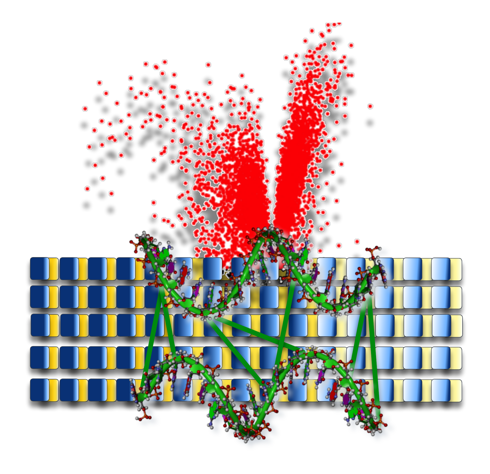

# **RNA-Seq Data Analysis**

{width="450"}

This RNA-Seq workshop aims to get you started with your own RNA-seq analysis and assumes you are already familiar with the basics of bash and R.

## Content

| **Lesson**                                         | **Overview** | 
|:---------------------------------------------------|:-------------|
|[1. Background](./1_background.md){ .md-button .md-button--primary } | General overview of a RNA-Seq workflow |
|[2. Quality Assessment](./2_qualityassessment.md){ .md-button .md-button--primary }|Assess the quality of data, How to use FastQC and MultiQC|
|[3. Trimming and Filtering](./3_trimmingfiltering.md){ .md-button .md-button--primary }| How to remove adapter sequences |
|[4. Mapping and Count](./4_mappingANDcount.md){ .md-button .md-button--primary }| Align/Map reads back to genome and number of reads from each sample that originated from that gene.|
|[5. Differential Expression Analysis](./5_rnaseq-diffexp.md){ .md-button .md-button--primary }|Differential expression analysis with R|
|[6. Over-representation analysis](./6_over-representation_analysis.md){ .md-button .md-button--primary }|Determine whether known biological functions or processes are over-represented (= enriched) in an experimentally-derived gene list|
|[Supplementary 1 - A Guide to RNA-Seq](./supp_1.md){ .md-button}||
|[Supplementary 2 - Lecture notes : DE analysis](./supp_2.md){.md-button}||
|[Supplementary 3 - Lecture notes : Annotation Data & Gene Set Analysis](./supp_3.md){.md-button}||

# Attribution notice
  
- The material used to prepare for the workshop was extracted from Professor Mik Black's lectures for **STAT435** - ***Data Analysis for Bioinformatics*** (University of Otago, Dunedin, New Zealand).

- Some code used in this workshop has been extracted from a collection of presentations, workshops and lectures by Prof. Thomas Girke, Institute for Integrative Genome Biology, UC Riverside: <a href="http://girke.bioinformatics.ucr.edu/">Link_1</a> and <a href="http://faculty.ucr.edu/~tgirke/HTML_Presentations/Manuals/MCBIOS2015/Rrnaseq/Rrnaseq.pdf">Link_2</a>
